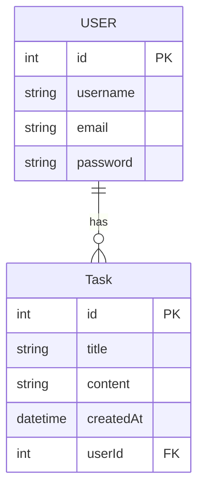

# Express- Créer une API REST avec Nodejs
## Pré-requis
- Partons du principe que nous avons deux modèles User et Task avec un OneToMany pour associer une Task à un User

*Diagramme des modèles Task et User*


### Lancer la base de données MySQL locale

1. Stopper le serveur MySQL local (si besoin)
```bash
systemctl stop mysql
systemctl disable mysql
```

> Il est néccessaire de stopper le serveur mysql local pour libérer le port 3306 de la machine linux.

1. Lancer la base de données MySQL via Docker
    a. **Si ce n'est pas déjà fait ! Créez le container bdd mysql**
    ```bash
    docker run --name bdd -e MYSQL_ROOT_PASSWORD=root -e MYSQL_DATABASE=app-database -p 3306:3306 mysql
    ```
    > Ce serveur mysql écoute le port 3306

    b. Ou sinon **lancer le container bdd**
    ```bash
    docker start bdd
    ```
2. Tester la connexion à la bdd
```bash
mysql -h127.0.0.1 -uroot -proot
```
3. Vous devriez arriver sur le shell mysql, faite la commande suivante pour vérifier que la base de données app-database a bien été créée.
```sql
mysql> SHOW DATABASES;
+--------------------+
| Database           |
+--------------------+
| app-database       |
| information_schema |
| mysql              |
| performance_schema |
| sys                |
+--------------------+
5 rows in set (0.00 sec)
```

### Initialisation Sequelize et définition des modèles

*Diagramme des modèles Task et User*


1. Créez un fichier `database.mjs` qui contient le code suivant pour initialiser la connexion à la base de données et définir les modèles Task et User. :

*database.mjs*
<details>
  <summary>Cliquez pour voir le fichier database.mjs </summary>


```js
import { Sequelize, DataTypes } from "sequelize";

/**
 * Initialise la connexion à la base de données et définit les modèles User et Task.
 * @return {Promise<Sequelize>} L'instance Sequelize connectée à la base de données.
 */
export async function loadSequelize() {
    try {

        const login = {
            database: "app-database",
            username: "root",
            password: "root"
        };
        // ----  0. Connexion au serveur mysql ---- 
        // Connexion à la BDD
        const sequelize = new Sequelize(login.database, login.username, login.password, {
            host: '127.0.0.1',
            dialect: 'mysql'
        });


        // ----  1. Création de tables via les models ---- 
        // Création des models (tables) -------------//
        const User = sequelize.define("User", {
            username: DataTypes.STRING,
            email: DataTypes.STRING,
            password: DataTypes.STRING
        });
        const Task = sequelize.define("Task", {
            title: DataTypes.TEXT,
            content: DataTypes.TEXT
        });

        User.hasMany(Task);
        Task.belongsTo(User);


        // CREER LES TABLES AVANT LA FONCTION sync !
        // -----------------------------------------//
        await sequelize.sync({ force: true });
        console.log("Connexion à la BDD effectuée")

        return sequelize;
 } catch (error) {
        console.log(error);
    }
}
```
</details>


2. Créez un fichier `app.mjs`, il contiendra le code de notre serveur web.

*app.mjs*
<details>
  <summary>Cliquez pour voir le fichier app.mjs</summary>

```js
// Déclarez vos imports ici
import { loadSequelize } from "./database.mjs";


// Fonction principale pour initialiser la base de données et démarrer le serveur
async function main(){
    const sequelize = await loadSequelize();
    const User = sequelize.models.User;
    const Task = sequelize.models.Task;
    
    // Codez TOUTE la suite ici...


    

}
main();
```
</details>

<br>

> Il est obligatoire de coder toutes votre application dans la fonction `main()` APRES l'appel de la fonction `loadSequelize()` car cette fonction est asynchrone et :
> - nous devons attendre la connexion à la base de données avant de continuer.
> - nous devons attendre la création des modèles avant de les utiliser dans nos routes.


Concrètement la suite de notre application que consitera quand la création de routes (url) sur notre serveur web en utilisant les modèles Sequelize User et Task pour interagir avec la base de données :
- Création d'utilisateur : `User.create(...)`
- Récupération des tâches : `Task.findAll(...)`
- Récupération des taches d'un utilisateur : `User.findByPk()` et  `user.getTasks()`

### Installer les dépendances

```bash
npm install sequelize mysql2 express jsonwebtoken cors
```

## Qu'est ce qu'un API REST ?
Une API REST (Representational State Transfer) est une architecture de communication entre un client et un serveur qui utilise les méthodes HTTP pour effectuer des opérations sur des ressources. Les ressources sont généralement représentées au format JSON.

Correctement : 
- une API REST est un serveur web qui reçoit et fournit des données au format JSON.
- une API REST utilise les méthodes HTTP (GET, POST, PUT, DELETE) pour effectuer des opérations sur les ressources (Mysql, Fichiers, etc.)
- Comme tout serveur web une API REST est composée de routes (url) auquelles le client accède via un client HTTP (le plus souvent via l'API `fetch` en JavaScript).

## Qu'est ce que express ?

Express est un framework web pour Node.js qui facilite la création d'applications web et d'API REST. Il fournit un ensemble de fonctionnalités pour gérer les requêtes HTTP, les routes, et les réponses.

Les actions d'un serveur Express sont analogue au méthodes du protocole HTTP.

- GET : Récupérer une donnée
- POST : Envoyer une donnée au serveur
- DELETE : Supprimer une donnée du serveur
- PUT : Modifier une donnée du serveur

## Init Serveur

1. Importer express avec :
```js
import express from 'express';
```


```js
// Déclarez vos imports ici
import { loadSequelize } from "./database.mjs";

// ++++
import express from 'express';


// Fonction principale pour initialiser la base de données et démarrer le serveur
async function main(){
    const sequelize = await loadSequelize();
    const User = sequelize.models.User;
    const Task = sequelize.models.Task;
    
    // Codez TOUTE la suite ici...
    

}
main();
```

2. Créez un serveur HTTP express avec la fonction `express()` :

```js
import express from "express";
const app = express();
```

Une api REST est composé de différentes routes (url) que l'utilisateur peut appeler via des requêtes HTTP.

Créons notre première route HTTP.

3. Ajoutez une route `GET /hello` avec la fonction `app.get()`.
```js
import express from "express";
const app = express();

app.get("/hello",(request,response)=>{
    response.send("<p>Hello World</p>");
});
```

La méthode get pendant deux arguments  en paramètre :
- Le chemin de la route : `/hello` (string)
- Une fonction executé lorsqu'un utilisateur fait une requête HTTP GET sur cette route. Cette fonction prend deux paramètres :
    - request : l'objet requête HTTP (contient les informations de la requête)
    - response : l'objet réponse HTTP (permet d'envoyer une réponse au client)

Un serveur HTTP est accesible via une adresse IP (localhost pour une machine locale) et un port (8000 par exemple).

> ***Definition fonction callback*** : Une fonction passée en paramètre est appelée une *fonction callback* ou fonction de rappel. 
> Elle est rappelée par le framework express a chaque fois que l'utilisateur fait une requête HTTP sur la route.

4. Lancez le serveur en localhost sur le port 8000 avec la fonction `app.listen()`.
```js
const express = require("express");
const app = express();

app.get("/hello",(request,response)=>{
    // J'envoie une string HTML au client via la méthode Response.send()
    response.send("<p>Hello World</p>");
});

app.listen(8000,()=>{
    console.log("Serveur rendez-vous sur http://localhost:8000");
});
```
> La fonction callback passée en second paramètre est appelée une fois que le serveur est bien lancé sur le port 8000.

Allez on regarde dans un navigateur !

5. Dans un navigateur tapez dans la barre de recherche : `localhost:8000/hello` pour lancer une requête HTTP GET sur la route /hello.


Voilà, vous avez crée votre première route HTTP avec express !

Cette route renvoi en body du texte html, la réponse HTTP brut ressemble à celle-ci.

*La réponse du serveur express*
```http
HTTP/1.1 200 OK

<p>Hello World</p>
```

*La requête du navigateur client*
```http
GET /hello HTTP/1.1
Host : localhost
```

## Tester ses routes avec Postman
Postman est un client HTTP qui permet de faire des requêtes HTTP (GET, POST, PUT, DELETE) sur des serveurs web (API REST par exemple).

Il permet de tester facilement les routes de votre serveur sans avoir à coder le front-end avant.

Vous pouvez l'installer avec snap en ligne de commande :

1. Installer snap
```bash
sudo apt install snapd
```

2. Installer postman
```bash
sudo snap install postman
```

3. Lancez postman
```bash
snap run postman
```
> Cette commande lance snap et monopolise le terminal pour les logs, vous pouvez ouvrir un autre terminal dans vscode pour continuer à coder.

> Il existe également une extension vscode Postman et une version web de Postman.

## Créer des routes

### GET /tasks

### POST /task (pour l'utilisateur 1 par défaut)


