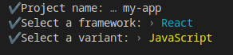
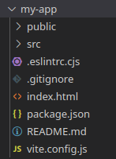
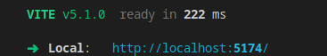

### Vite 
https://vitejs.dev/

Vite est un bundler JavaScript, concrètement c'est un programme qui va lire votre code JavaScript, JSX ou encore TypeScript et le compiler en un code optimisé pour les navigateurs.

Vite vous fournit également un serveur web local de développement donc pas besoin de WAMP, XAMPP ou autre.

Pour créer un projet React avec Vite il vous faut :
1. Installer NPM (Node Package Manager)
2. Taper une commande pour créer un projet JavaScript préconfiguré pour React.
3. Taper une commande pour lancer le serveur web 
4. Commencer à coder :)

> Vite peut très facilement être dockerisé via une image docker de node et un port binding du port (-p).

## Créer un projet React avec Vite.
### 1. Installer NodeJS
#### Windows
Téléchargez `node` ici : https://nodejs.org/

#### Mac
```bash
brew install node
```

#### Linux (Debian / Ubuntu)
```bash
apt install nodejs npm
```
> Attention cependant, apt n'utilise pas la dernière version de nodejs. Pour l'avoir, il faut rajouter le dépôt à votre machine linux avant de l'installer. 
> Voir les instructions d'installation ici : https://github.com/nodesource/distributions?tab=readme-ov-file#using-ubuntu

### Mettre à jour nodejs

```bash
npm install -g n
n stable
```

### 2. Créez le projet avec Vite
Dans votre dossier de travail.
```bash
npm create vite
```
Répondez aux questions de configuration comme ceci.



### 3. Ouvrez le projet dans VSCode
Vite vous a créé une application exemple dans le dossier `my-app` (le nom que vous avez donné au projet).

**Ouvrez ce dossier dans VSCode.**



- **`/public`, contiendra vos images**, vidéos ou audio. Toute chose qui nécessite un accès public, comme l'attribut `src` de la balise `` par exemple, doit être dans le dossier `public`.
- **`/src`, contient tout votre code.** C'est ici que vous travaillerez la majorité du temps.
- **`index.html`, la page d'accueil du site.** C'est le point de départ de votre application.
- **`.eslintrc.cjs`**, est un fichier de configuration qui aide à repérer des bugs dans votre appli. Vous pouvez ignorer ce fichier.
- **`.gitignore`**, définit les dossiers ignorés par git.
- **`package.json`** et **`package-lock.json`**, gèrent les dépendances de npm installées avec `npm install`.
- **`vite.config.js`**, configure `Vite` pour fonctionner sans encombre avec `React`.

### 4. Lancez le serveur web localhost
Ouvrez un terminal dans votre projet VSCode et tapez :
```bash
npm install # Installation des dépendances du projet
npm run dev # Lancement du serveur web localhost
```
- `npm install` installe les éventuelles dépendances du projet. 
- **`npm run dev` lance un serveur web** pour votre projet et vous fournit l'adresse IP du serveur, habituellement `localhost:XXXX`.
> Une fois `npm install` effectuée, vous n'aurez pas besoin de la relancer la prochaine fois.

Lorsque vous voyez ce message, votre projet est prêt et disponible via l'adresse localhost fournie par vite.


<strong style="font-size:30px">C'est fait !</strong>

### "Ça ne marche pas !" En cas de souci.
Si vous n'arrivez pas à faire fonctionner les commandes ci-dessus, voici le résumé, vous pouvez les copier-coller. ;)

Dans votre dossier de travail, ouvrez un terminal et tapez :
```bash
npm create vite@latest my-app -- --template react
cd my-app
npm install
npm run dev
```
