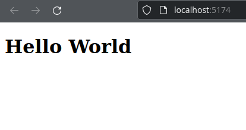

## Un premier pas sur React
React s'occupe exclusivement de l'UI et pour ce faire il va créer un DOM virtuel qu'il copiera dans le véritable DOM de votre application quand un rafraîchissement est nécessaire.

React a donc besoin d'un point d'entrée dans votre page html pour fonctionner, une balise d'origine dans laquelle toute l'arborescence de l'application React se trouvera.

### Hello World
1. Supprimez tout le contenu du dossier `/src`.
2. Dans le dossier `/src`, créez un fichier nommé `main.jsx`, ce fichier est le point d'entrée de notre application.
3. Dans le fichier `src/main.jsx` écrivez un hello world.

*/src/main.jsx*
```jsx
console.log("Hello Main");
```

4. Dans le fichier */index.html* vérifiez que le fichier */src/main.jsx* est bien importé.

*/index.html*
```html
<!doctype html>
<html lang="fr">
  <head>
    <meta charset="UTF-8" />
    <meta name="viewport" content="width=device-width, initial-scale=1.0" />
    <title>My App</title>
  </head>
  <body>
    <div id="root"></div>
    <!-- J'importe main.jsx dans le html -->
    <script type="module" src="/src/main.jsx"></script>
  </body>
</html>
```

5. Ouvrez la console du navigateur, vous devriez y voir le message `"Hello Main"`.

> ***Extension .jsx dans la balise `<script>`*** 
>```html 
><script type="module" src="/src/main.jsx"></script>
>```
>`.jsx` est une extension inconnue des navigateurs web mais `Vite` compile notre code en JavaScript à chaque sauvegarde donc tout va bien. Au final, le code source importé sera en `.js`. :)

### Votre premier composant React.
Tout fonctionne, il est temps de créer notre premier composant React.

Un composant est la brique élémentaire de React, vous pouvez imaginer les composants React comme des nouvelles balises HTML sur mesure que vous codez en JavaScript (plus précisément en jsx).

1. Vérifiez la présence d'une balise `<div>` avec pour id `root` dans le `index.html`. C'est dans cette balise que React place les composants que vous codez.

*/index.html*
```html
<!doctype html>
<html lang="fr">
  <head>
    <meta charset="UTF-8" />
    <meta name="viewport" content="width=device-width, initial-scale=1.0" />
    <title>My App</title>
  </head>
  <body>
    <!-- Une balise vide avec pour id root -->
    <!-- C'est cette balise que React remplira avec les composants que vous coderez -->
    <div id="root"></div>
    <script type="module" src="/src/main.jsx"></script>
  </body>
</html>
```

Dans le fichier /src/main.jsx.

2. Utilisez la méthode ReactDOM.createRoot() pour créer un composant React lié à la balise `div#root`.
*/src/main.jsx*
```jsx
import React from "react";
import ReactDOM from "react-dom/client";

const root = ReactDOM.createRoot(document.querySelector("#root"));
```

3. Affichez le composant avec la méthode render.
*/src/main.jsx*
```jsx
import React from "react";
import ReactDOM from "react-dom/client";

const root = ReactDOM.createRoot(document.querySelector("#root"));
/* Affichage du composant root  */
root.render(<h1>Hello World</h1>);
```
Ce code affiche (render) le composant root dans la balise #root. Le contenu du composant root est un simple h1 Hello World.


Ce code est le point de départ de tout projet React. Il vous paraîtra plus clair plus tard mais vous n'avez pour l'instant pas d'intérêt à comprendre le processus plus que les explications fournies plus haut.

#### En résumé
1. La méthode ReactDOM.createRoot permet de créer un composant React lié à une véritable balise HTML.
2. La méthode render permet d'afficher le composant.
3. La méthode render prend en paramètre du JSX, soit le HTML à afficher.

C'est la seule fois où nous utiliserons createRoot pour créer un élément React, toute la suite se fera en JSX.


### L'encapsulation des composants
Pour l'instant toute votre application est un simple `<h1>`, évidemment le code va grossir et nous voulons donc encapsuler tout notre code React dans un composant appelé **`<App />`**.

1. Dans le fichier main.jsx créez une fonction App() qui renvoie un `<h1>` en tant que JSX.

*src/main.jsx*
```jsx
// à la suite du code précédent...

function App(){
    return <h1> Hello World</h1>;
}
```
Ceci est un composant fonctionnel, c'est-à-dire un composant React créé dans une fonction. C'est sous cette forme que la majorité de votre code React sera écrit.

2. Affichez le composant `App` dans la fonction `root.render()`.

```jsx
import React from "react";
import ReactDOM from "react-dom/client";

const root = ReactDOM.createRoot(document.querySelector("#root"));

root.render(<App/>);  // Afficher le nouveau composant App

function App(){
    return <h1> Hello World</h1>;
}
```

Le composant nouvellement créé est affiché en tant que point de départ de notre appli dans la balise *#root*.
Pour améliorer la clarté du code, JSX nous permet d'écrire le composant App comme du HTML.
```jsx
root.render(<App/>);
```
En réalité le code suivant donnerait le même résultat.
```js
root.render(App()); // Même résultat mais moins explicite.
```