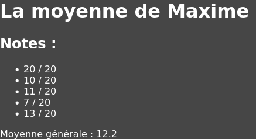

# Passer d'une tableau JavaScript à un tableau JSX

Pour chaque élève il faut créer une balise `<li>` contenant le nom. Cette action est réalisable facilement avec un `map()`.
```tsx
function App(){
    const eleves = ["Mathieu","Arnaud","Cléo","François"];
    const elevesElements = eleves.map( eleve => <li>{eleve}</li> );
    return (
        <div>
            <h1>La liste des élèves</h1>
            <ul>
                {elevesElements}
            </ul>
        </div>
    );
}
```


> #### **Rappel `Array.prototype.map()`**
> La méthode `Array.prototype.map()` permet de transformer un tableau en un nouveau tableau composé des valeurs de retour de la fonction callback passée en paramètre. Si vous devez modifier tout le contenu d'un tableau sans en changer le nombre d'éléments c'est un `map()` qu'il vous faut.
> https://developer.mozilla.org/fr/docs/Web/JavaScript/Reference/Global_Objects/Array/map

La constante `elevesElements` est un array de composants React, le JSX ne fait que parcourir le tableau et afficher chaque composant dans l'ordre.

*Mapper* un array JavaScript en un nouveau array de composants est une action très commune en React. En situation réelle ce tableau d'élèves pourrait très bien venir d'une base de données ou d'une API par exemple. 

On peut d'ailleurs supprimer la constante `elevesElements` et placer le `map()` dans le JSX directement.

```jsx
function App(){
    const eleves = ["Mathieu","Arnaud","Cléo","François"];
    return (
        <div>
            <h1>La liste des élèves</h1>
            <ul>
                {eleves.map( eleve => <li>{eleve}</li> )}
            </ul>
        </div>
    );
}
```

### Exercice 1 - La moyenne de Maxime
Affichez la liste des notes de Maxime et la moyenne de ses notes.
> **Astuce** : vous pouvez utiliser la fonction **Array.prototype.reduce()**.
```jsx
function App(){
    const notes = [20,10,11,7,13];
    return (
        <div>
            <h1>La moyenne de Maxime </h1>
            <h2>Notes :</h2>
            <ul>

            </ul>
            <p>Moyenne générale : </p>
        </div>
    );
}
```

***Attention correction juste en dessous !***
<pre>


</pre>
#### Correction Exercice 1 - La moyenne de Maxime
```jsx
function App(){
    const notes = [20,10,11,7,13];
    const average = notes.reduce((sum,note)=>sum+note) / notes.length;
    return (
        <div>
            <h1>La moyenne de Maxime </h1>
            <h2>Notes :</h2>
            <ul>
                {notes.map( note => <li>{note} / 20</li> )}
            </ul>
            <p>Moyenne générale : {average}</p>
        </div>
    );
}
```


`Array.prototype.reduce()` est à utiliser dans le cas où vous voulez récupérer une seule valeur à partir d'un tableau. Ici par exemple à partir du tableau de notes je veux en récupérer la somme.

Le même résultat est obtenable à partir d'une variable tampon et une boucle for classique sur le tableau de notes. 

```jsx
function App(){
    const notes = [20,10,11,7,13];
    // -- Équivalent de la fonction reduce ---
    let sum = 0;  // la variable tampon qui contient la somme des notes
    for (let i = 0; i < notes.length; i++) {
        sum+= notes[i];        
    }
    // ---------
    const average = sum/notes.length;
    return (
        <div>
            <h1>La moyenne de Maxime </h1>
            <h2>Notes :</h2>
            <ul>
                {notes.map( note => <li>{note} / 20</li> )}
            </ul>
            <p>Moyenne générale : {average}</p>
        </div>
    );
}
```

Les méthodes map, reduce et filter sont à connaître sur le bout des doigts pour écrire du JavaScript plus concis. 

### Exercice 2 - La liste des élèves
Affichez la liste des élèves, pour chaque élève, affichez son prénom et sa classe.
```jsx
function App(){
    let eleves = [
        { name : "Massinissa", grade : "4eme" },
        { name : "Arnaud", grade : "3eme" },
        { name : "Cléo", grade : "3eme" },
        { name : "Louis", grade : "6eme" },
    ];
    return (
        <div>
            // Codez ici ...
        </div>
    );
}
```

***Attention correction juste en dessous !***

<pre>


</pre>

#### Correction Exercice 2 - La liste des élèves
```tsx
function App(){
    let eleves = [
        { name : "Massinissa", grade : "4eme" },
        { name : "Arnaud", grade : "3eme" },
        { name : "Cléo", grade : "3eme" },
        { name : "Louis", grade : "6eme" },
    ];
    const elevesElements = eleves.map((eleve)=>{
        return (
            <div>
                <h2>{eleve.name}</h2>
                <p>{eleve.grade}</p>
            </div>
        );
    });
    return (
        <div>
            {elevesElements}
        </div>
    );
}
```