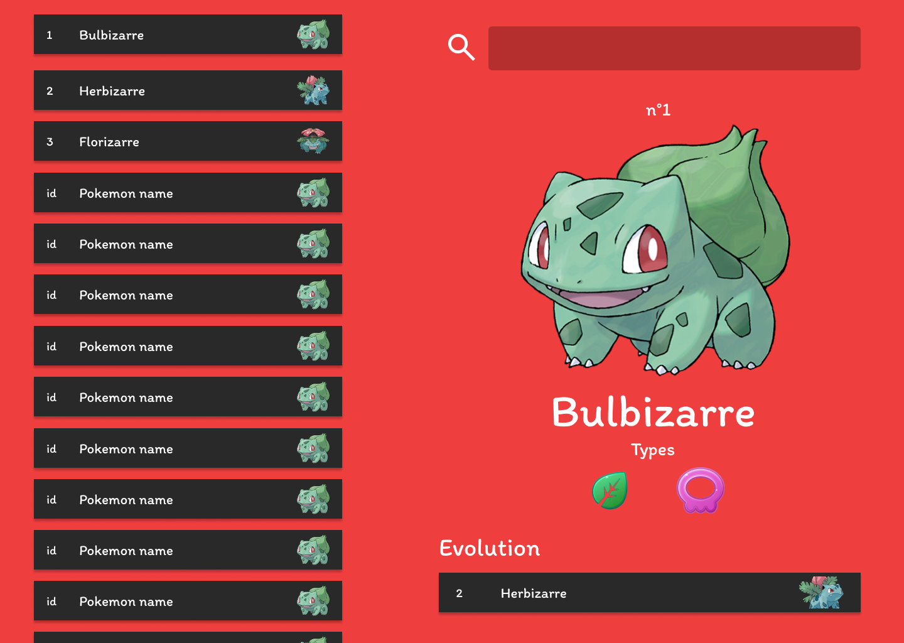
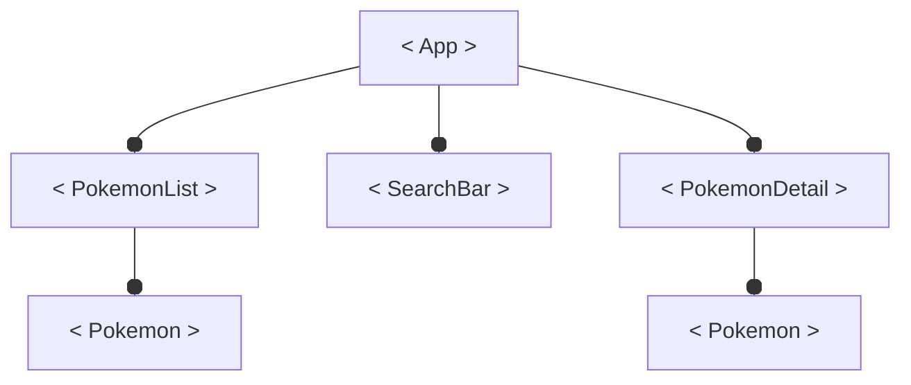

## Les composants
La conception d'une application React commence toujours par le découpage de la maquette en composants.

Une application est composée de plusieurs blocs imbriqués les uns dans les autres. Le développement d'une application avec React consiste à la création de tous ces blocs pour pouvoir, au final, assembler toute l'application.

Ces briques d'éléments graphiques s'appellent des composants et pour le moment vous n'avez créé qu'un seul composant : le composant racine `<App/>`.

Les composants étant imbriqués, ils sont organisés en arborescence. Le composant App est le composant racine, il est obligatoire.

Prenons par exemple la maquette d'un pokedex. Selon vous, combien contient-elle de composants **différents** ?

J'en compte 4 différents.

Le composant `<Pokemon>` qui est utilisé dans la liste de pokémons et pour indiquer l'évolution du pokémon.
.png)

Le composant `<PokemonList>` qui liste tous les pokémons existants dans un menu défilable.
.png)

Le composant `<SearchBar>` qui permet de rechercher un pokémon.
.png)

Le composant `<PokemonDetail>` qui affiche les informations d'un pokémon (nom, id, image, types et évolution) lorsque l'utilisateur clique sur un `<Pokemon>` ou recherche un pokémon avec la `<SearchBar>`.
.png)

Une fois les différents composants identifiés, on remarque une arborescence qui se dessine.

.png)
