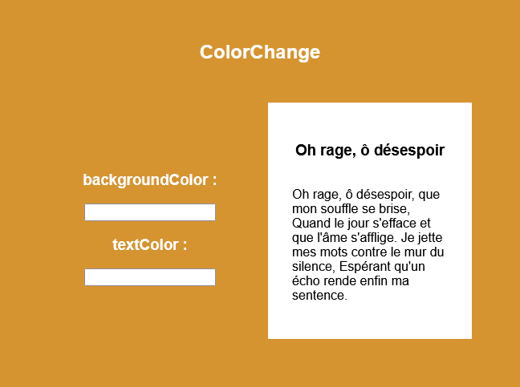

# Exercice ColorChange
Un Composant qui permet de modifier les propriété backgroundColor et color d'un Article de blog.
- backgroundColor : couleur ou hexadecimal 
- color : couleur ou hexadecimal

## Démo
Rendez-vous sur : http://whiletrue.fr:8080

ou lancez le container dopcker suivant :
```bash
docker run -p 8080:80 chaouchi/react-exo-usestate
```
## Maquette



## Pré-requis :
- useState
- onChange Event
- style object


## Correction
https://github.com/CHAOUCHI/demo-react-state/tree/master/src/components
