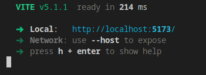
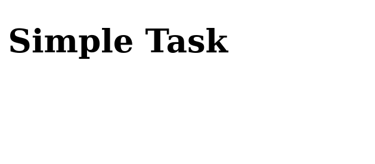
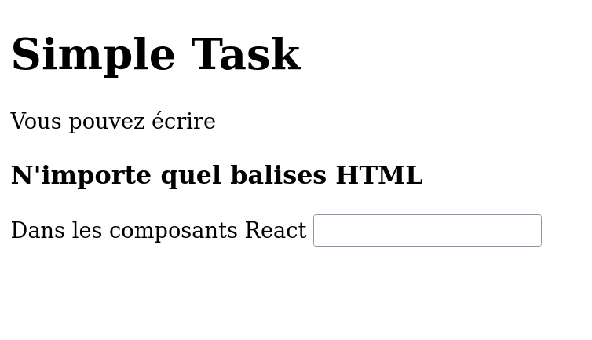
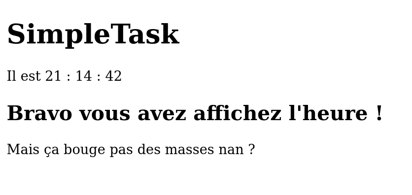
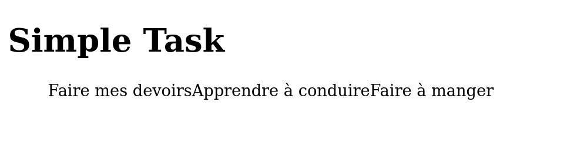
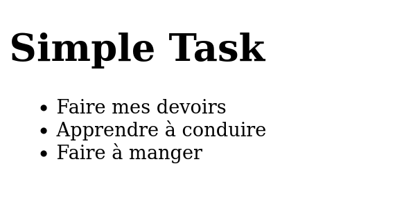
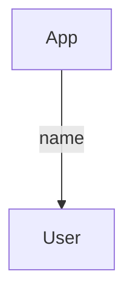
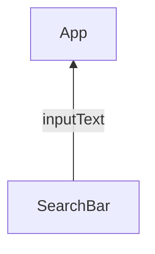

# Apprendre React
On va créer "une liste de tâches à faire" avec React.

Testez le rendu final en téléchargeant le projet sur votre PC.

```bash
git clone "https://github.com/CHAOUCHI/ReactSimpleNotesCDA.git"
cd simple-task
npm install
npm run dev
```

Dans cette appli toute simple, je peux :
- Ajouter des tâches
- Voir les tâches que j'ajoute

## Mise en place du projet
Démarrez un projet React JavaScript avec Vite et nommez-le `simple-task`.
```bash
npm create vite
cd simple-task
npm install
npm run dev
```

Supprimez tout le contenu du dossier `src`.

Dans le dossier `src` :

1. Créez le fichier *main.jsx* suivant
```jsx
import React from 'react'
import ReactDOM from 'react-dom/client'
import {App} from './App.jsx'

ReactDOM.createRoot(document.getElementById('root')).render(
  <React.StrictMode>
    <App />
  </React.StrictMode>,
)
```

2. Créez le fichier *App.jsx* suivant
```jsx
export function App() {
  return (
    <div>
      <h1>Simple Task</h1>
    </div>
  )
}
```

Ouvrez votre application sur votre navigateur à l'adresse localhost fournie par *Vite*.

Voilà, le projet est en place.


## Les composants
Une application web est faite de composants, c'est-à-dire plusieurs blocs d'UI, comme des listes de produits, des barres de recherche, des profils d'utilisateurs.

### Le composant racine App
Le composant App est le point d'entrée de notre application.

Il renvoie des balises HTML à afficher sur ma page. Vous pouvez évidemment construire votre page en écrivant du HTML dans le div retourné par App.

```jsx
export function App() {
  return (
    <div>
      <h1>Simple Task</h1>
      <p>Vous pouvez écrire</p>
      <h3>N'importe quelle balise HTML</h3>
      <div>
          <label> Dans les composants React </label>
          <input type="text" name="" id="" />
      </div>
    </div>
  )
}
```

> Attention : écrivez exclusivement votre HTML entre les balises div du composant App.



## Afficher une variable dans le HTML

Vous imaginez bien que React ne permet pas juste d'écrire du HTML statique. L'intérêt de React, c'est la facilité avec laquelle je peux ajouter du JavaScript à l'intérieur.

```jsx
export function App() {
    let appName = "SimpleTask";
    let task = "Faire les courses";

    return (
        <div>
            <h1>{appName}</h1>
            <ul>
                <li>{task}</li>
            </ul>
        </div>
    )
}
```
Ici je déclare deux variables que j'affiche directement dans le HTML.

Pour "passer en mode JS" dans mon HTML, il me suffit d'ouvrir des accolades à n'importe quel endroit de mon HTML. Toute valeur qui se trouve dans les accolades sera placée dans le HTML.

```jsx
export function App() {
  const appName = "SimpleTask";
  const date = new Date();
  return (
    <div>
      <h1>{appName}</h1>
      <p>Il est {date.getHours()} : {date.getMinutes()} : {date.getSeconds()} </p>
      <h2>Bravo vous avez affiché l'heure !</h2>
      <p>Mais ça bouge pas des masses nan ?</p>
    </div>
  )
}
```


## Les states

React permet d'afficher du JavaScript dans du HTML, c'est vrai, mais React permet surtout de créer des variables qui mettent à jour automatiquement l'affichage quand elles sont modifiées.

On appelle ces variables des états (*states*). Ce sont des variables qui, lorsqu'elles sont modifiées, mettent à jour l'affichage du composant.

### Exemple 1 : une horloge
Ici je vais faire de ma `date` un state pour que l'heure se mette à jour quand on la modifie.

Pour créer un state, je dois utiliser la fonction `useState`. Elle me fournit un état date et une fonction qui permet de modifier cet état.
```jsx
const [date,setDate] = useState(new Date());
```

*/src/App.jsx*
```jsx
import { useState } from "react";

export function App() {
  const appName = "SimpleTask";

  const [date,setDate] = useState(new Date());

  // Dans une seconde...
  setTimeout(()=>{
      // Je mets à jour la date
      setDate(new Date());
  },1000);

  return (
    <div>
      <h1>{appName}</h1>
      <p>Il est {date.getHours()} : {date.getMinutes()} : {date.getSeconds()} </p>
      <h2>Bravo vous avez affiché l'heure !</h2>
      <p>Ca bouge ! 🫨</p>
    </div>
  )
}
```


> Un state est une variable qui, lorsqu'elle est modifiée, met à jour l'affichage de son composant. Étant donné que React doit effectuer des actions de son côté pour mettre à jour l'affichage du composant, il faut utiliser la fonction setNomDuState pour mettre à jour le state.
> Les states sont une des features les plus importantes de React. Si vous devez afficher quelque chose qui doit changer avec le temps ou en fonction de clics, d'inputs utilisateurs ou autres, il vous faut un state.

## Exemple 2 - Incrémentation
Un autre exemple de state est un bouton d'incrémentation.

Je souhaite augmenter le nombre de produits de mon panier quand je clique sur un bouton.

```jsx
import { useState } from "react";

export function App() {
  const [count,setCount] = useState(0);
  return (
    <div>
      <p>Nike air</p>
      <p>{count} produits dans le panier.</p>
      <button>Ajouter un produit</button>
    </div>
  )
}
```

React me permet de réagir à l'événement "click" d'une balise HTML en lui fournissant une fonction.

```jsx
import { useState } from "react";

export function App() {
  const [count,setCount] = useState(0);

  return (
    <div>
      <p>Nike air</p>
      <p>{count} produits dans le panier.</p>
      <button onClick={ ()=>{setCount(count+1)} } >Ajouter un produit</button>
    </div>
  )
}
```
***Quand l'événement click apparaît sur le bouton : appelle la fonction fléchée `()=>{ setCount(count+1) }`.***

*onClick* est une propriété fournie par React. Cette propriété prend pour valeur une fonction.

```jsx
<button onClick={ ()=>{setCount(count+1)} } >Ajouter un produit</button>
```

> C'est le même principe qu'une fonction fléchée passée dans une fonction addEventListener, mais cette fois-ci passée dans une propriété HTML.

# Afficher une liste de tâches

Ajoutez des tâches en dur dans l'application.
```jsx
export function App() {
  return (
    <div>
      <ul>
        <li>Faire mes devoirs</li>
        <li>Apprendre à conduire</li>
        <li>Ne plus arriver en retard</li>
      </ul>
    </div>
  )
}
```
Dans notre application l'utilisateur peut ajouter des tâches dans une liste de tâches via un formulaire.

Cela signifie que le nombre de mes tâches va évoluer, j'ai donc besoin d'un state.

Je crée un tableau de tâches en tant que state et j'affiche ses éléments dans le HTML.
```jsx
import { useState } from "react";

export function App() {
  // Au départ j'ai deux tâches dans mon application
  const [tasks,setTasks] = useState([
    "Faire mes devoirs",
    "Apprendre à conduire"
  ]);
  return (
    <div>
      <h1>Simple Task</h1>
      <ul>
        <li>{tasks[0]}</li>
        <li>{tasks[1]}</li>
      </ul>
    </div>
  )
}
```
Le souci, c'est que si le nombre d'éléments du tableau augmente je n'en afficherai toujours que deux. Il nous faudrait parcourir le tableau et afficher chaque tâche dans un `<li>`.

### Transformer un tableau en un tableau d'éléments HTML.

React nous permet d'afficher un tableau.
```jsx
import { useState } from "react";

export function App() {
  // Au départ j'ai deux tâches dans mon application
  const [tasks,setTasks] = useState([
    "Faire mes devoirs",
    "Apprendre à conduire",
    "Faire à manger",
  ]);

  return (
    <div>
      <h1>Simple Task</h1>
      <ul>
        { tasks }
      </ul>
    </div>
  )
}
```

Ce n'est pas encore tout à fait ça : React a affiché tous les éléments du tableau, mais mon tableau contient des chaînes de caractères brutes. Il me faudrait un tableau de `<li>`.

```jsx
import { useState } from "react";

export function App() {
  // Au départ j'ai deux tâches dans mon application
  const [tasks,setTasks] = useState([
    "Faire mes devoirs",
    "Apprendre à conduire",
    "Faire à manger",
  ]);

    // la fonction map renvoie chaque élément du state, encapsulé dans une balise <li></li>
  const tasksElements = tasks.map((task,i)=><li key={i}>{task}</li>);
  return (
    <div>
      <h1>Simple Task</h1>
      <ul>
        { tasksElements }
      </ul>
    </div>
  )
}
```

> La fonction array.map en JS permet de transformer un tableau en un autre tableau.



J'ai une belle liste de tâches qui s'affiche. Il ne reste plus qu'à en rajouter de nouvelles quand un formulaire est soumis.

# Ajouter une tâche
Pour ajouter une tâche, il faut créer un formulaire HTML qui va modifier le state `tasks` lorsqu'il est soumis.
```jsx
import { useState } from "react";

export function App() {
  const [tasks,setTasks] = useState([
    "Faire mes devoirs",
    "Apprendre à conduire",
    "Faire à manger",
  ]);

  const tasksElements = tasks.map((task,i)=><li key={i}>{task}</li>);
  return (
    <div>
      <h1>Simple Task</h1>

      <form>
        <input type="text" name="task" />
        <button>Ajouter</button>
      </form>

      <ul>
        { tasksElements }
      </ul>
    </div>
  )
}
```
Au même titre que j'utilisais la propriété onClick pour réagir au clic d'un bouton, j'utilise la propriété onSubmit du formulaire pour réagir à l'envoi du formulaire.

```jsx
import { useState } from "react";

export function App() {
  const [tasks,setTasks] = useState([
    "Faire mes devoirs",
    "Apprendre à conduire",
    "Faire à manger",
  ]);
  
  function onAddTask(event){
    event.preventDefault(); // J'annule le rechargement de la page

    const newtask = (new FormData(event.target)).get("task");

    setTasks([
      ...tasks,
      newtask
    ]);
  }
  
  const tasksElements = tasks.map((task,i)=><li key={i}>{task}</li>);
  return (
    <div>
      <h1>Simple Task</h1>
      <form onSubmit={onAddTask}>
        <input type="text" name="task" />
        <button>Ajouter</button>
      </form>
      <ul>
        { tasksElements }
      </ul>
    </div>
  )
}
```


> FormData est un objet JS qui permet de manipuler facilement les données d'un formulaire.

> Le *spread operator* `...` permet de fusionner un tableau dans un autre tableau. C'est utilisé pour cloner le tableau.

# Encapsuler les composants
On a fini notre application, c'est très bien. Maintenant il faut clarifier le code et encapsuler les composants pour pouvoir les réutiliser à l'avenir.

Nous allons encapsuler le `<li>` de la tâche pour créer la balise `<Task />`.

## Créer un fichier Task.jsx dans le src.

Dans ce fichier, déplacez le code nécessaire à l'affichage d'une tâche.

```jsx
export function Task(){
    return (
        <div>
            <li>Une tâche</li>
        </div>
    )
}
```
On peut se servir de ce nouveau composant à la place du li en l'utilisant dans App.
```jsx
import { useState } from "react";
import { Task } from "./Task";
export function App() {
  const [tasks,setTasks] = useState([
    "Faire mes devoirs",
    "Apprendre à conduire",
    "Faire à manger",
  ]);
  
  function onAddTask(event){
    event.preventDefault();

    const newtask = (new FormData(event.target)).get("task");

    setTasks([
      ...tasks,
      newtask
    ]);
  }
  
  /**
   * Le composant li est devenu une balise Task.
   * */
  const tasksElements = tasks.map((task,i)=><Task key={i} />);

  return (
    <div>
      <h1>Simple Task</h1>
      <form onSubmit={onAddTask}>
        <input type="text" name="task" />
        <button>Ajouter</button>
      </form>
      <ul>
        { tasksElements }
      </ul>
    </div>
  )
}
```

On appelle cette action l'encapsulation.

Le souci, c'est qu'il n'y a rien de dynamique dans le composant Task. Il faut donc passer en paramètre à Task la tâche à afficher.

# Passer une donnée du parent à l'enfant, de haut en bas

*/src/Task.jsx*
```jsx
export function Task({task}){
    return (
        <div>
            <li>{task}</li>
        </div>
    )
}
```

Maintenant que Task peut prendre une tâche en props, je vais modifier App pour lui fournir la tâche à afficher.

```jsx
import { useState } from "react";
import { Task } from "./Task";
export function App() {
  const [tasks,setTasks] = useState([
    "Faire mes devoirs",
    "Apprendre à conduire",
    "Faire à manger",
  ]);
  
  function onAddTask(event){
    event.preventDefault();

    const newtask = (new FormData(event.target)).get("task");

    setTasks([
      ...tasks,
      newtask
    ]);
  }
  
  //-----------------------------------------Je passe une valeur à la props task
  const tasksElements = tasks.map((task,i)=> <Task key={i} task={task}/>);

  return (
    <div>
      <h1>Simple Task</h1>
      <form onSubmit={onAddTask}>
        <input type="text" name="task" />
        <button>Ajouter</button>
      </form>
      <ul>
        { tasksElements }
      </ul>
    </div>
  )
}
```

Voilà, le projet fonctionne toujours mais le code est plus clair. Il s'agit donc maintenant de faire la même chose avec le formulaire. Il faut l'encapsuler.

# Passer une donnée de l'enfant au parent, de bas en haut
On souhaite encapsuler le formulaire dans un autre composant AddTask. Le composant AddTask sera séparé proprement du code de App mais, en contrepartie, n'aura plus accès au state tasks.
Le souci, c'est que le formulaire modifie le state tasks à la soumission.

Il faut donc un moyen pour AddTask de modifier le state.

## Créer le composant AddTask
Dans un fichier AddTask.jsx

*/src/Addtask.jsx*
```jsx
export function AddTask(){
    
    function onSubmit(event){
        event.preventDefault();
        const newtask = (new FormData(event.target)).get("task");
        // J'ai la tâche à ajouter dans le state de App... mais comment faire ?
    }
    return (
        <form onSubmit={onSubmit}>
            <input type="text" name="task" />
            <button>Ajouter</button>
        </form>
    );
}
```

J'ajoute AddTask dans App, pour l'instant il n'est pas encore fonctionnel.
*/src/App.jsx*
```jsx
import { useState } from "react";
import { Task } from "./Task";
import { AddTask } from "./AddTask";

export function App() {
  const [tasks,setTasks] = useState([
    "Faire mes devoirs",
    "Apprendre à conduire",
    "Faire à manger",
  ]);
  
  const tasksElements = tasks.map((task,i)=> <Task key={i} task={task}/>);
  return (
    <div>
      <h1>Simple Task</h1>

      <AddTask />
      
      <ul>
        { tasksElements }
      </ul>
    </div>
  )
}
```

App doit fournir une fonction qui ajoute une tâche à AddTask.
Pour fournir une donnée à un enfant on utilise les props comme pour le composant Task.
Je vais donc passer la fonction `addTask` à AddTask via la prop onAddTask.
```jsx
import { useState } from "react";
import { Task } from "./Task";
import { AddTask } from "./AddTask";

export function App() {
  const [tasks,setTasks] = useState([
    "Faire mes devoirs",
    "Apprendre à conduire",
    "Faire à manger",
  ]);
  
  function addTask(newTask){
    setTasks([...tasks,newTask]);
  }
  
  const tasksElements = tasks.map((task,i)=> <Task key={i} task={task}/>);
  return (
    <div>
      <h1>Simple Task</h1>
      <AddTask onAddTask={addTask}/>
      <ul>
        { tasksElements }
      </ul>
    </div>
  )
}
```

AddTask possède une nouvelle prop, c'est une fonction qui ajoute une tâche. Revenons dans *AddTask.jsx* pour l'utiliser

*/src/AddTask.jsx*
```jsx
// -------Je rajoute onAddTask dans les props accessibles-------
export function AddTask({onAddTask}){
    
    function onSubmit(event){
        event.preventDefault();
        const newTask = (new FormData(event.target)).get("task");
        // J'ai une tâche à ajouter dans le state... mais comment faire ?

        // J'appelle la fonction donnée par App et je lui donne newTask 
        // pour qu'il puisse l'enregistrer de son côté.
        onAddTask(newTask);
        
    }
    return (
        <form onSubmit={onSubmit}>
            <input type="text" name="task" />
            <button>Ajouter</button>
        </form>
    );
}
```


# Résumé
React permet de créer des applications web interactives très rapidement.
Les bases de React sont :
- Les composants
- Les states
- Les props

## Composants
Un composant est une fonction qui renvoie du HTML.

Il se déclare dans un fichier à part comme ceci.
```jsx
export function MonComposant(){
    return (
        <div>
            <h1>Hello component</h1>
        </div>
    )
}
```

Et s'appelle dans un autre composant comme le composant App par exemple de cette manière.
```jsx
import { MonComposant } from "./MonComposant.jsx";

export function App() {

  return (
    <div>
        <MonComposant />
    </div>
  )
}
```

## Props
Je peux paramétrer un composant via des propriétés appelées props.
```jsx
import { User } from "./User.jsx";

export function App() {

  return (
    <div>
        <User nom="Louis"/>
    </div>
  )
}
```

```jsx
export function User({nom}){
    return (
        <div>
            <h1>Hello {nom}</h1>
        </div>
    )
}
```

## Événement
Je peux réagir à un événement grâce à l'ensemble de props fournies par React, comme onClick, onSubmit, onChange, onScroll.
```jsx
export function User({nom}){
    return (
        <div>
            <h1>Hello {nom}</h1>
            <button onClick={console.log("Coucou")}>Dire bonjour</button>
        </div>
    )
}
```

## State
Si j'ai besoin d'afficher quelque chose de variable j'utilise un état ou *state*.
Les states sont créés avec la fonction useState() qui prend en paramètre la valeur de départ de l'état.
Un état est, dans la grande majorité des cas, modifié lors d'un événement.

```jsx
export function User({nom}){
    const [name,setName] = useState(nom);   // Je définis un state name
    function changeName(event){
        const newName = event.target.value;
        setName(newName);   // Je modifie le state quand l'event change apparaît
    }
    return (
        <div>
            <input onChange={changeName}/>
            <h1>Hello {name}</h1>
        </div>
    )
}
```

## Faire circuler l'information dans l'application
Quand vous concevez une application React, réfléchissez toujours à l'arborescence du projet et au chemin que peuvent parcourir les données.

Parfois un enfant a besoin de données de son parent, parfois c'est le parent qui a besoin de récolter des données générées par l'enfant.

### Parent vers Enfant

Si j'ai une information à donner à un enfant, je la passe simplement en props.
```jsx
import { User } from "./User.jsx";

export function App() {

  return (
    <div>
        <User nom="Louis"/>
    </div>
  )
}
```

```jsx
export function User({nom}){
    return (
        <div>
            <h1>Hello {nom}</h1>
        </div>
    )
}
```

### Enfant vers Parent
Si je veux envoyer une information d'un composant enfant vers un composant parent, j'utilise une fonction callback en prop. 

Si le parent a besoin de récolter une information de son enfant, il peut lui fournir une fonction en prop.
L'enfant va exécuter au bon moment la fonction fournie et passer en paramètre l'info demandée par le parent.

Par exemple, un composant enfant qui gère les entrées clavier de l'utilisateur puis envoie le texte écrit au parent.


Le composant App passe une fonction à SearchBar dans l'espoir qu'il l'appelle un jour pour lui donner le user input en paramètre.
```jsx
import { SearchBar } from "./SearchBar.jsx";

export function App() {
    function onUserWrite(inputText){
        console.log(inputText);     // Affiche l'input user de la SearchBar
    }
    return (
        <div>
            <SearchBar onUserWrite={onUserWrite}/>
        </div>
    )
}
```
Pour ce faire, le composant SearchBar appelle la fonction passée en props par App et fournit le texte écrit par l'utilisateur en paramètre.
```jsx
export function SearchBar({onUserWrite}){
    function handleChange(event){
        const inputText = event.target.value;
        onUserWrite(inputText);    // Fournit à App l'input user
    }
    return (
        <div>
            <input onChange={handleChange}/>
            <h1>Hello {name}</h1>
        </div>
    )
}
```