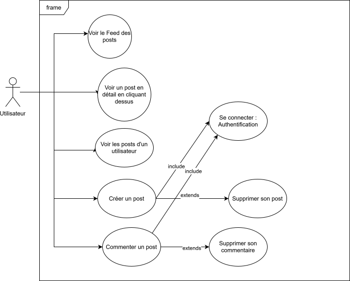

# Cahier des charges — Frontend SPA (ThreadFront)

## 1. Synopsis
Application frontend Single Page (React + Vite) pour consommer l'API ThreadAPI (réseau social type Twitter).  
Objectif : permettre aux utilisateurs de s'inscrire, se connecter, créer/consulter/supprimer des posts et commentaires, et naviguer de manière réactive (SPA).

## 2. Pré-requis
- API ThreadAPI déployée et accessible (CORS configuré, cookies JWT utilisables).
- Environnement dev : Node.js, npm ou yarn, Vite.
- Stack : React, react-router, state management (Context + useReducer ou équivalent), TypeScript (optionnel mais recommandé).
- Outils : Postman/Insomnia pour tests, navigateur moderne.
- Variables d'environnement : URL_API, mode (dev/prod), clé de config si nécessaire.

## 3. Use Cases (principaux)

1. Inscription
    - Utilisateur saisit username/email/password → POST /register → JWT reçu en cookie → redirection vers feed.
2. Connexion / Déconnexion
    - Login: POST /login → JWT cookie → accès aux actions protégées.
    - Logout: POST /logout → cookie supprimé → redirection vers page publique.
3. Voir le fil (Feed)
    - GET /posts → affiche liste de posts + commentaires, tri par date.
4. Voir post détaillé
    - Route /posts/:postId → affiche post et commentaires, possibilité de commenter si connecté.
5. Créer un post
    - Formulaire protégé → POST /posts → ajout en tête du feed (optimistic UI).
6. Commenter un post
    - POST /posts/:postId/comments → mise à jour du post courant.
7. Supprimer post/commentaire
    - DELETE /posts/:postId ou /comments/:commentId → uniquement auteur ou admin.
8. Voir posts d’un utilisateur
    - GET /users/:userId/posts → page profil public.

## Maquette

- Maquette interactive : https://www.figma.com/proto/vEsBGPrM2GiEJefd4N1gr7/Untitled?node-id=4-3&t=s0yEueAvqUQCyiJT-1&scaling=scale-down&content-scaling=fixed&page-id=0%3A1&starting-point-node-id=4%3A3&show-proto-sidebar=1

- Maquette figma : https://www.figma.com/design/vEsBGPrM2GiEJefd4N1gr7/ThreadFront?node-id=4-3&t=83JfTQCMtdO29K9b-1

> Icons Font Awesome

> Font : Google font `Josefin Sans` : https://fonts.google.com/specimen/Josefin+Sans

## Register /register

## Login /login

## Feed /

### DetailPost /post/:id

### Profile /profile

### CreatePost /create/post

## 4. Cahier des Charges (Fonctionnel & Non-fonctionnel)
Fonctionnel (obligatoire)
- Authentification via JWT stocké en cookie sécurisé (HTTPOnly côté API). Front enverra credentials/cookies lors des requêtes protégées.
- Pages/Routes :
  - / (Feed public)
  - /login, /register
  - /posts/:postId
  - /users/:userId
  - /profile (mon profil, mes posts)
  - /create-post
- CRUD réduit :
  - Create post, Create comment, Delete post/comment (avec vérif d’autorisation côté API).
- Gestion des erreurs visibles (toast) pour cas critiques : mauvais identifiants, actions non autorisées, données invalides, ressources absentes.
- Validation client-side des formulaires (titre, contenu, email).
- Pagination ou lazy-load/infinite scroll pour /posts.

- Sécurité : ne pas stocker le JWT dans localStorage; dépendre aux cookies (API doit être config).
- Typescript recommandé : types pour User/Post/Comment, services API.

Critères d'authorization
- Login : mauvais identifiants => message d'erreur; JWT non présent => accès refusé aux routes protégées.
- Register : doublon utilisateur => message précis; validation champs.
- Création post/commentaire : utilisateur non authentifié => redirection /login.
- Suppression : tentative non autorisée => message d'erreur et UI inchangée.
- GET allPosts : aucun post => affichage d’un état vide invitant à créer un post.

Mapping routes API → actions frontend
- POST /register → action Register (form)
- POST /login → action Login (form)
- POST /logout → action Logout
- GET /posts → fetch feed (pagination)
- POST /posts → create post
- GET /posts/:postId → fetch post + comments
- POST /posts/:postId/comments → add comment
- DELETE /posts/:postId → delete post (confirm)
- DELETE /comments/:commentId → delete comment
- GET /users/:userId/posts → profile / user's posts

<!-- Contraintes techniques -->
<!-- - Gérer l’envoi de cookies : fetch/axios withCredentials: true. -->
<!-- - Centraliser appels API dans un service (apiClient) pour gérer en-têtes, erreurs, retry si utile. -->
<!-- - Protection des routes frontend : wrapper PrivateRoute qui vérifie session via endpoint /me ou présence cookie validé par API. -->

## 5. Concepts clés & Architecture recommandée
- Architecture composants :
  - Pages (Feed, PostDetail, Profile, Auth)
  - ReactRouter : BrowserRouter
  - useContext
  - Composants UI (PostCard, CommentList, PostForm, CommentForm, Header, Footer)
  <!-- - Layouts (PublicLayout, PrivateLayout) -->
<!-- - Auth Context -->
  <!-- - Stocke user minimal (id, username), méthodes login/logout, état authenticated. -->
  <!-- - Hydratation initiale via call GET /me ou endpoint qui valide cookie. -->