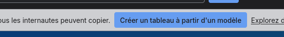

1. Créer un trello à partir du modèle suivant via le bouton Créer à partir d'un modèle: 

https://trello.com/invite/b/69368c62cf9bba8488b76c7a/ATTIb35484a4bbc7b008030456da7b17ce126F4CEACA/agilemodele

2. Consulter le cahier des charges
3. Faites votre première réunion de Sprint Planning pour définir les tâches de la semaine (debut d'aprem max)
4. Faites votre premier Daily Scrum (15 min pour chaque membre de l'équipe, en début de journée)
5. Travaillez sur votre tâche et refaites un daily scrum le lendemain matin jusqu'à vendredi.
6. Faites votre Sprint Review le vendredi en fin d'après-midi (1h max)
7. Recommencez à l'étape 3 pour la semaine suivante(le Lundi)