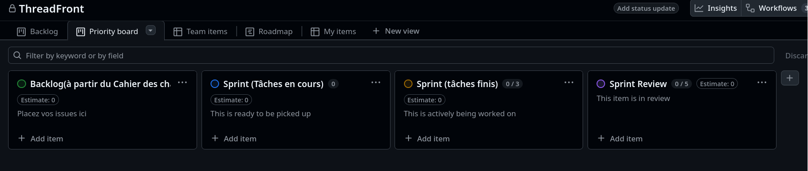

1. Créez un GitHub Project à partir du modèle suivant :

2. Consultez le cahier des charges.  
3. Faites votre première réunion de Sprint Planning pour définir les tâches de la semaine (début d'après-midi au plus tard).  
4. Faites votre premier Daily Scrum (15 minutes pour chaque membre de l'équipe, en début de journée).  
5. Travaillez sur votre tâche et refaites un Daily Scrum le lendemain matin jusqu'à vendredi.  
6. Faites votre Sprint Review le vendredi en fin d'après-midi (1 heure maximum).  
7. Recommencez à l'étape 3 pour la semaine suivante (le lundi).  

