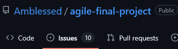
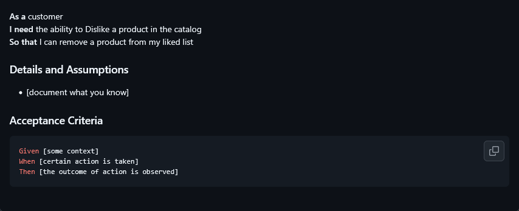

## Exemples de dépôts publics réels et leurs user stories

## IBM Coursera - Writing User Stories for Agile Software Development
Ce dépôt simule un projet réel de catalogue produit avec une structure Agile complète.

Il donne des exemples de user stories pour le back d'une boutique en ligne.

https://github.com/Amblessed/agile-final-project/issues

*Cliquez sur issues pour voir les user stories créées*

Vous y verrez les issues closes (user stories terminées) pour vous inspirer.

## Mon dépôt Jira pour l'application Fepalfu
J'ai remis en forme les epics et user stories d'une application mobile sur laquelle je travaille pour vous aider à comprendre comment faire.

https://chaouchi.atlassian.net/jira/software/projects/SCRUM/boards/1

> Jira est l'outil professionnel le plus utilisé pour gérer les projets en méthode agile, similaire à *GitHub Projects* mais en plus complet.

> Je vais le mettre en public bientôt mais en attendant vous pouvez me demander l'accès si vous voulez y jeter un œil.

# Le dépôt Solid 
Lui c'est votre meilleur ami pour comprendre comment découper des user stories en tâches techniques.

C'est un projet open source et libre qui a "en gros" pour objectif de redonner le contrôle des données personnelles aux utilisateurs. C'est un projet mis en place par Tim Berners-Lee, l'inventeur du World Wide Web (WWW).

Dans le dépôt suivant vous trouverez des user stories réelles utilisées par l'équipe de développement de Solid créées par des Scrum Masters professionnels ET des débutants.

**Vous pourrez donc facilement vous inspirer de ces user stories pour créer les vôtres.**

https://github.com/solid/user-stories/issues

