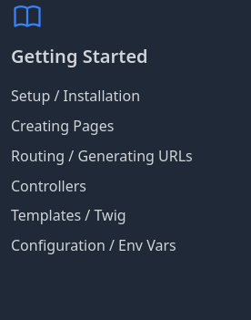

## Installation de Symfony

Documentation officielle : https://symfony.com/doc/current/setup.html

1. Installer le Symfony CLI
```bash
curl -1sLf 'https://dl.cloudsmith.io/public/symfony/stable/setup.deb.sh' | sudo -E bash
sudo apt install symfony-cli
```
> Doc : https://symfony.com/download

2. Vérifier les dépendances nécessaires
```
symfony check:requirements
```

3. Installer PHP et ses paquets obligatoires
```bash
sudo apt update
# Installe les paquets de ondrej qui permet de changer de version de PHP si besoin (Symfony nécessite au moins PHP 8.4)
sudo apt install software-properties-common
sudo add-apt-repository ppa:ondrej/php
sudo apt update

# Installe PHP 8.4 et les extensions nécessaires à Symfony (voir la doc)
sudo apt install php8.4-common php8.4-cli php8.4-ctype php8.4-iconv php8.4-xml php8.4-tokenizer php8.4-mbstring php8.4-intl php8.4-mysql php8.4-sqlite3
```

4. Exécutez la commande `php -v` pour vérifier que vous avez la bonne version.
```bash
php -v
```
Vous devez voir ce résultat dans la console :
```bash
PHP 8.4.19 (cli) (built: Mar 30 2026 19:28:35) (NTS)
Copyright (c) The PHP Group
Built by Debian
Zend Engine v4.4.19, Copyright (c) Zend Technologies
    with Zend OPcache v8.4.19, Copyright (c), by Zend Technologies
```

5. Installer Composer
> Doc d'installation de Composer : https://getcomposer.org/download/
> Composer est le gestionnaire de paquets de PHP, équivalent à NPM pour JavaScript

```bash
php -r "copy('https://getcomposer.org/installer', 'composer-setup.php');"
php -r "if (hash_file('sha384', 'composer-setup.php') === 'c8b085408188070d5f52bcfe4ecfbee5f727afa458b2573b8eaaf77b3419b0bf2768dc67c86944da1544f06fa544fd47') { echo 'Installer verified'.PHP_EOL; } else { echo 'Installer corrupt'.PHP_EOL; unlink('composer-setup.php'); exit(1); }"
php composer-setup.php
php -r "unlink('composer-setup.php');"
```
```bash
sudo mv composer.phar /usr/local/bin/composer
```

6. Exécutez la commande `composer` pour vérifier s'il est bien installé et disponible dans la console.
```bash
composer
```
Vous devez voir ce résultat dans la console :

```bash
   ______
  / ____/___  ____ ___  ____  ____  ________  _____
 / /   / __ \/ __ `__ \/ __ \/ __ \/ ___/ _ \/ ___/
/ /___/ /_/ / / / / / / /_/ / /_/ (__  )  __/ /
\____/\____/_/ /_/ /_/ .___/\____/____/\___/_/
                    /_/
Composer version 2.9.5 2026-01-29 11:40:53
```

7. Dans un nouveau terminal, exécutez la commande `symfony check:requirements`. Le résultat suivant signifie que tout va bien :
```bash
symfony check:requirements
```
Vous devez voir ce résultat dans la console :

```bash
Symfony Requirements Checker
~~~~~~~~~~~~~~~~~~~~~~~~~~~~

> PHP is using the following php.ini file:
/etc/php/8.4/cli/php.ini

> Checking Symfony requirements:

.............................

                                              
 [OK]                                         
 Your system is ready to run Symfony projects 
                                              

Note  The command console can use a different php.ini file
~~~~  than the one used by your web server.
      Please check that both the console and the web server
      are using the same PHP version and configuration.
```

8. Pour finir, installez `sqlite3` (un SGDB plus léger que MySQL en local, il n'a pas besoin de connexions ni du port 3306 TCP) et `sqlitebrowser` (l'équivalent de phpMyAdmin pour SQLite).
```bash
sudo apt install sqlite3
sudo apt install sqlitebrowser
```

## Hello World Symfony
> SI CE N'EST PAS FAIT, vérifiez que vous avez bien déclaré votre identité à Git
> ```bash
>   git config --global user.email "you@example.com"
>   git config --global user.name "Your Name"
> ```

1. Créer un projet Symfony
```bash
symfony new hello-projet --version="8.0.*" --webapp
```

2. Se déplacer dans le dossier du projet
```bash
cd hello-projet
```

3. Démarrer le serveur de développement de Symfony
```bash
symfony server:start
```

4. Ouvrir votre navigateur à l'adresse `http://localhost:8000` et vous devriez voir la page d'accueil de Symfony
*Résultat*


## Getting Started
Rendez-vous sur ce lien et effectuez le getting started de Symfony où vous apprendrez à créer des contrôleurs et des vues.


