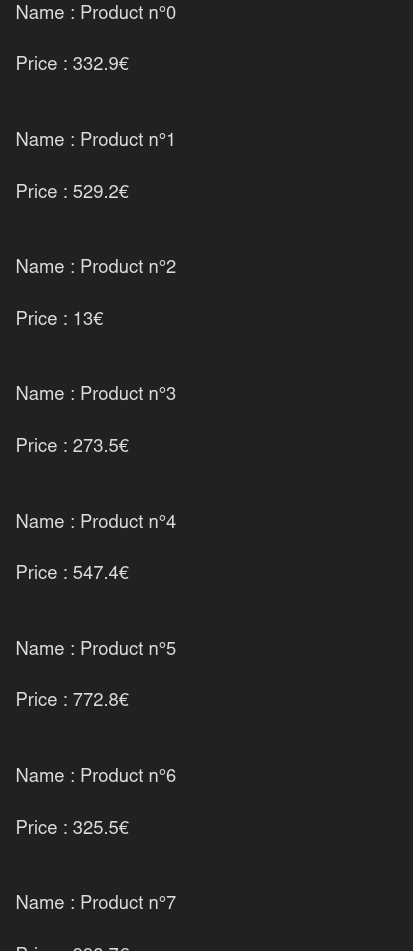

# Symfony Fixtures - Données de Test pour la BDD
Une Fixture est un ensemble de données de test que vous pouvez charger dans votre base de données pour faciliter le développement et les tests. Symfony utilise le bundle **DoctrineFixturesBundle** pour gérer les fixtures.

> En Anglais *Fixture* signifie *fixation* une fixture permet enfaite de définir des données de test sans jamais avoir besoin de les réécrire à chaque fois, elles sont donc *fixes*. D'où le nom de *Fixture*.
> Wikipedia : Une fixture est un morceau de code qui permet de fixer un environnement logiciel pour exécuter des tests logiciels. Cet environnement constant est toujours le même à chaque exécution des tests. Il permet de répéter les tests indéfiniment et d'avoir toujours les mêmes résultats. 

## Installation du Bundle
Pour utiliser les fixtures dans Symfony, vous devez installer le bundle **DoctrineFixturesBundle**. Exécutez la commande suivante dans votre terminal :

```bash
composer require --dev orm-fixtures
```

## Objectifs

Soit le controlleur suivant qui affiche la liste des produits :

*DashboardController.php*
```php
<?php

namespace App\Controller;

use Symfony\Bundle\FrameworkBundle\Controller\AbstractController;
use Symfony\Component\HttpFoundation\Response;
use Symfony\Component\Routing\Attribute\Route;

final class DashboardController extends AbstractController
{
    #[Route('/', name: 'app_dashboard')]
    public function index(ProductRepository ): Response
    {
        return $this->render('dashboard/index.html.twig', [
            'controller_name' => 'DashboardController',
        ]);
    }
}
```


*dashboard/index.html.twig*
```twig


Hello DashboardController!




    <div>
        <p>Name : {{product.name}}</p>
        <p>Price : {{product.price}}€</p>
    </div>




```

Pour l'instant je n'ai pas de produits dans ma BDD, aucun produits n'est donc afficher a l'écran.


## Création d'une Fixture

Pour créer une fixture, vous devez créer une classe qui implémente l'interface `FixtureInterface` ou qui étend la classe `Fixture`. Cette classe doit être placée dans le répertoire `src/DataFixtures`. Par convention, les classes de fixtures sont nommées avec le suffixe `Fixture`. Par exemple, pour créer une fixture pour les produits, vous pouvez créer une classe `ProductFixture`.

Heursement MakerBundle nous facilite la tâche, il va générer une classe de fixture pour nous. Exécutez la commande suivante dans votre terminal :

```bash
symfony console make:fixture ProductFixture
```

Cette commande vous a crée une classe qui servira à contenir les requetes INSERT INTO pour ajouter des produits dans votre base de données. Voici à quoi ressemble la classe générée :

*ProductFixture.php*
```php
<?php

namespace App\DataFixtures;

use Doctrine\Bundle\FixturesBundle\Fixture;
use Doctrine\Persistence\ObjectManager;
use App\Entity\Product;

class ProductFixtures extends Fixture
{
    public function load(ObjectManager $manager): void
    {
        // $product = new Product();
        // $manager->persist($product);

        // $manager->flush();
    }
}
```

## Ecrire la Fixture

Pour ajouter une centaine de produits je peux donc faire une simple boucle for et à chaque itération créer un nouveau produit, le persister et enfin flusher le manager pour enregistrer les produits dans la base de données.

```php
<?php

namespace App\DataFixtures;

use Doctrine\Bundle\FixturesBundle\Fixture;
use Doctrine\Persistence\ObjectManager;
use App\Entity\Product;

class ProductFixtures extends Fixture
{
    public function load(ObjectManager $manager): void
    {
        for ($i=0; $i < 100; $i++) { 
            $product = new Product();
            $product->setName("Product n°".$i);
            $product->setPrice(rand(10,10000)/10);
            $manager->persist($product);
        }

        $manager->flush();
    }
}
```

## Charger les Fixtures (les données dans la bdd)

Il ne reste plus qu'à exécuter la commande suivante pour charger les fixtures dans la base de données :

```bash
symfony console doctrine:fixtures:load
```

## Résultat

Si je retourne sur ma page d'accueil, j'ai maintenant une liste de 100 produits qui s'affiche à l'écran.

