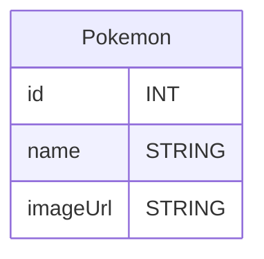

# Exercices Apprendre Symfony - Pokedex
https://www.figma.com/proto/QqmOnuXmZ6l6pAH35E3Hut/Exercice-Pokedex-Symfony?node-id=1-2&t=Pp17uf6fCczRyMYh-1&scaling=contain&content-scaling=fixed&page-id=0%3A1&starting-point-node-id=1%3A2&show-proto-sidebar=1

## Exercice 1 Mardi 11
Implémenter en statique (HTML/CSS) la première maquette qui affiche plusieurs Pokémon avec Symfony (pas d'accès à la BDD ici).

Pré-requis : 
- symfony new
- symfony console make:controller
- Twig block, for
- tailwind Symfony & composer require

## Exercice 2 Mercredi 15
Ajouter des pokémons dans la base de données avec l'EntityRepository et modifier la page d'accueil pour que les pokémons affichés proviennent de la BDD.

Pré-requis : 
- symfony console make:entity
- symfony console make:migration
- symfony console doctrine:migrations:migrate
- .env SQLITE
- sqlbrowser

## Exercice 3 Jeudi 16
Implémenter la page d'ajout grâce à symfony console make:crud ou make:form.

Pré-requis : 
- symfony console make:crud
- tailwind
- Twig

## Exercice 4
Ajouter la connexion et l'authentification (voir cours Auth sur mon GitHub et les liens de la doc).
- Associer les pokémons ajoutés à un utilisateur pour qu'il soit personnel et donc visible uniquement au dresseur qui l'a ajouté. 
- User hasMany Pokemon
- Pokemon belongsToOne User