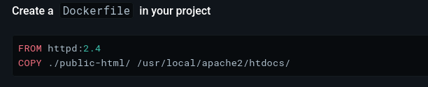
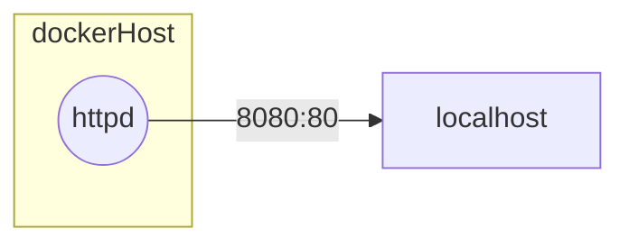

## Exemple de conteneurisation d'un serveur web (apache ou nginx)

### 1. **Développement** : Les développeurs codent l'application

*projet/index.html*
```js
<!DOCTYPE html>
<html lang="en">
<head>
    <meta charset="UTF-8">
    <meta http-equiv="X-UA-Compatible" content="IE=edge">
    <meta name="viewport" content="width=device-width, initial-scale=1.0">
    <title>Mon joli serveur web</title>
</head>
<body>
    <h1>Bienvenue sur mon joli serveur web !</h1>
</body>
</html>
```

### 2. **Documentation** : Les développeurs écrivent de la documentation pour expliquer comment lancer l'application ainsi que les ports TCP qu'elle écoute (*listen*).

*La documentation du déploiement de l'application respecte souvent le même schéma :*
```
## Prérequis (requirements)
## Installation des dépendances (dependencies)
## Lancement de l'application (run)
```

> **Note :** Documenter le déploiement d'une application est obligatoire pour le passage du titre DWWM (*cf. REAC DWWM 2023*)

#### Prérequis (requirements)
1. Un serveur web (apache ou nginx)
#### Installation des dépendances (dependencies)

Ce projet ne nécessite aucune dépendance, cependant pour qu'un serveur web puisse servir un site web, il faut que les fichiers du site soient présents dans le dossier de l'application du serveur web (ex: /var/www/html pour apache), donc il suffit de copier le code source de notre application dans ce dossier.

- Voir la doc pour apache : https://hub.docker.com/_/httpd#create-a-dockerfile-in-your-project
- Ou la doc pour nginx : https://hub.docker.com/_/nginx#hosting-some-simple-static-content

> Il est très important de lire la documentation officielle des images que vous utilisez par exemple ici je veux utiliser httpd le container apache serveur. Dans la doc je peux voir que le site web est servi depuis le dossier `/usr/local/apache2/htdocs/`, donc je sais que je dois copier mon code source dans ce dossier pour que mon site soit servi par apache.
> 

#### Lancement de l'application (run)

- L'application est un démon (une application qui tourne sur le port 80 en continu). Donc pour la lancer il suffit de lancer le serveur web après s'être assuré que les fichiers du site sont présents dans le dossier de l'application du serveur web (ex: /var/www/html pour apache).


Voilà on a bien documenté le lancement de notre application, on peut maintenant passer à l'étape suivante : la conteneurisation de l'application avec Docker.


### 3. **Build** : Le DevOps écrit un *DockerFile*, un fichier texte qui copie le code source et définit les commandes linux à exécuter pour lancer l'application.

Pour construire une nouvelle image il est important de résumer l'architecture réseau de notre application. En effet, notre application est un serveur web qui écoute sur le port 80, donc pour que les utilisateurs puissent accéder à notre application, il faut exposer le port 80 de notre conteneur vers l'extérieur de Docker, c'est à dire vers notre machine locale (localhost). Ainsi les utilisateurs pourront accéder à notre application en se connectant à localhost:80.

En résumé mon application ressemble à ça :



1. Créer un fichier `DockerFile` à la racine du projet à l'aide de la documentation : 


*projet/DockerFile*
```Dockerfile
# 1. On part d'une image de base qui contient déjà nodejs
FROM httpd
# 2. On copie le code source public de notre application dans le conteneur
COPY . /usr/local/apache2/htdocs/
# 5. On ouvre le port 80 du container pour que les utilisateurs puissent accéder à l'application
EXPOSE 80
# 6. Pas de commande à exécuter pour lancer l'application car le serveur web est un démon qui tourne en continu, il se lance automatiquement lorsque le conteneur est lancé
```
> Attention à ce que le fichier `DockerFile` soit bien à la racine du projet, sinon la commande `docker build` ne pourra pas trouver le code à copier coller dans le conteneur.
> `COPY . /usr/local/apache2/htdocs/`

2. Construire l'image docker et la nommer, ici on la nomme `frontend-basic` mais vous pouvez lui donner le nom que vous voulez.
```bash
docker build -t frontend-basic .
```

> `-t` : pour taguer l'image avec un nom, la syntaxe est `-t <nom_image>`, dans notre cas on utilise `-t frontend-basic` pour nommer notre image `frontend-basic`.
> `.` : pour spécifier le contexte de build, c'est à dire le dossier où se trouve le fichier `DockerFile` et le code source de l'application, dans notre cas on utilise `.` pour spécifier que le contexte de build est le dossier courant (la racine du projet).

### 4. **Run** : Le DevOps exécute le conteneur sur le serveur en précisant les ports TCP à ouvrir pour que les utilisateurs puissent accéder à l'application.

Pour exécuter un container il faut utiliser la commande `docker run` en précisant les arguments suivants :
- `-p` : pour exposer les ports TCP de l'application vers l'extérieur du conteneur, la syntaxe est `-p <port_exterieur>:<port_interieur>`, dans notre cas on veut exposer le port 3000 de l'application vers le port 3000 de notre machine locale, donc on utilise `-p 3000:3000`.
- `--name` : pour donner un nom à notre conteneur, c'est plus facile de gérer les conteneurs avec des noms plutôt que des IDs générés aléatoirement, dans notre cas on va nommer notre conteneur `jolieapidebilly` pour faire simple.

1. Lancer le conteneur, ici je vais le lancer sur le port 8080 comme ça je ne rentre pas en conflit avec d'autres applications qui pourraient déjà utiliser le port 80 sur ma machine locale.

```bash
docker run -p 8080:80 --name frontend-basic frontend-basic
```

2. Tester la route *http://localhost:8080* dans le navigateur pour vérifier que notre site web fonctionne correctement

