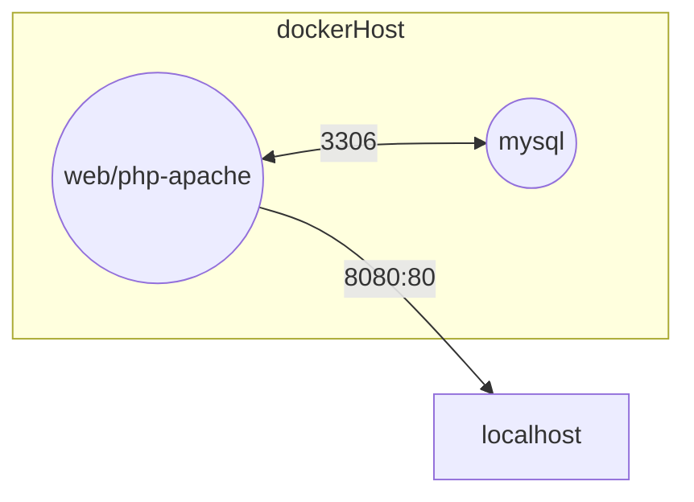
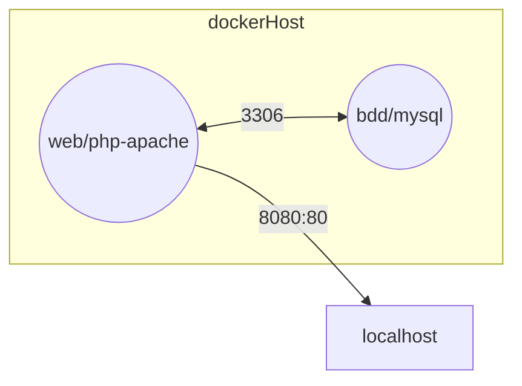

# Exemple de containerisation de plusieurs conteneurs (services) avec Docker Compose


En résumé mon application ressemble à ça :


- **php-apache** : c'est une image Docker qui contient un serveur web Apache avec PHP installé.
- **mysql** : c'est le serveur de base de données MySQL qui stocke les données de notre site web, il écoute sur le port 3306 à l'intérieur du conteneur et on ne l'expose pas vers l'extérieur du conteneur car il n'est pas nécessaire que les utilisateurs puissent accéder directement à la base de données, **le serveur web Apache communique avec MySQL en se connectant au port 3306 du conteneur MySQL avec les bons identifiants.**


## Cas d'école : Deux conteneurs doivent communiquer entre eux
Lorsque deux conteneurs doivent communiquer entre eux, il faut les faire communiquer à l'aide d'un réseau Docker, c'est-à-dire un réseau virtuel qui permet aux conteneurs de se connecter entre eux comme s'ils étaient sur le même réseau local.

Il est possible d'utiliser la commande `docker network` pour créer un réseau Docker et connecter les conteneurs à ce réseau, mais c'est plus simple d'utiliser Docker Compose qui permet de définir les services, les réseaux et les volumes dans un fichier `compose.yml` et de lancer l'application avec une seule commande (`docker compose up`).

1. Étape 1 : Faire le schéma de l'architecture réseau de l'application pour comprendre comment les conteneurs vont communiquer entre eux et avec l'extérieur de Docker.
2. Étape 2 : Créer un fichier `compose.yml` pour définir les services (conteneurs) de l'application, leurs ports et éventuellement leurs variables d'environnement.
3. Étape 3 : Créer un fichier `DockerFile` pour les conteneurs réseau qui doivent être paramétrés avant leur démarrage : httpd doit recevoir le code source mais MySQL non donc il n'a pas besoin de DockerFile.
4. Étape 4 : Lancer l'application avec la commande `docker compose up` et tester que tout fonctionne correctement.


### 1. Schéma de l'architecture réseau de l'application


### 2. *compose.yaml* et arborescence du projet

1. À la racine du projet, créez un fichier `compose.yaml`.
2. Et un dossier web, il contient le code source de notre application web (HTML, PHP, CSS, JS, etc.).
3. Puis un fichier `DockerFile` dans le dossier web pour construire l'image de notre serveur web Apache qui va servir notre site web.


4. Remplissez le Dockerfile comme suit :
*web/Dockerfile*
```Dockerfile
FROM php:8.2-apache

# Installer les extensions PHP nécessaires pour se connecter à MySQL
RUN docker-php-ext-install pdo pdo_mysql mysqli
# Activer le module rewrite d'Apache pour pouvoir utiliser les URLs personnalisées dans notre application web (dans le cas d'un MVC par exemple)
RUN a2enmod rewrite

# Copier le code source de notre application web dans le dossier racine du serveur Apache à l'intérieur du conteneur
COPY . /var/www/html/
EXPOSE 80
```

5. Remplissez le index.php comme suit :
*web/index.php*
```php
<?php

$DATABASE_HOST = "bdd";
$DATABASE_NAME = "ma-bdd";
$DATABASE_USER = "root";
$DATABASE_PASS = "root";
$bdd = new PDO("mysql:host=$DATABASE_HOST;dbname=$DATABASE_NAME",$DATABASE_USER,$DATABASE_PASS);
var_dump($bdd);
?>

<!DOCTYPE html>
<html lang="en">
<head>
  <meta charset="UTF-8">
  <meta http-equiv="X-UA-Compatible" content="IE=edge">
  <meta name="viewport" content="width=device-width, initial-scale=1.0">
  <title>Document</title>
</head>
<body>
  <h1>Test de connexion à la base de données</h1>
  <p>Si vous voyez un objet PDO, la connexion à la base de données a réussi.</p>
</body>
</html>
```

Au final notre réseau Compose se lancera puis :
1. la base de données démarre
2. Apache PHP démarre
3. L'utilisateur se rend sur localhost:8080
4. Apache reçoit la requête et exécute le code PHP de index.php
5. le code PHP de index.php se connecte à la base de données MySQL en utilisant les identifiants de connexion à la base de données
6. si la connexion à la base de données réussit, l'utilisateur voit ceci :


#### Étape 1 : Le service bdd
> Doc de l'image MySQL : https://hub.docker.com/_/mysql/

À retenir :
- image : mysql
- ports : NON exposé
- environnement : Il faut définir des variables d'environnement pour configurer les identifiants de connexion à la base de données
  - MYSQL_ROOT_PASSWORD : mot de passe de l'utilisateur root de MySQL
  - MYSQL_DATABASE : nom de la base de données à créer automatiquement au démarrage du conteneur
- USERNAME : (par défaut le username de root s'appelle root)
- HOSTNAME : Tout service Docker Compose possède un enregistrement DNS à son nom. Pour accéder à MySQL depuis le service web, il faut utiliser le nom du service MySQL comme hostname, dans notre cas c'est `bdd`.

> En gros on pourrait se connecter à la base de données MySQL en utilisant les identifiants suivants à l'intérieur du conteneur web :
> ```bash
> mysql -h bdd -u root -p root
> ```

1. Créer le service bdd dans le fichier compose.yaml

```yaml
services:
  bdd:
  image: mysql:latest
```

2. Ajoutez les variables d'environnement pour configurer la connexion (comme décrit dans la doc Docker Hub)
```yaml
services:
  bdd:
  image: mysql:latest
  environment:
    MYSQL_DATABASE: ma-bdd
    MYSQL_ROOT_PASSWORD: root
```
#### Le service web

> Doc de l'image php:8.2-apache : https://hub.docker.com/_/php#apache-with-a-dockerfile

1. Créer le service web dans le fichier compose.yaml
```yaml
services:
  web:

  bdd:
  image: mysql:latest
  environment:
    MYSQL_DATABASE: ma-bdd
    MYSQL_ROOT_PASSWORD: root
```

2. Plutôt que lui donner une image toute faite, on va lui construire une image personnalisée à l'aide d'un Dockerfile, pour cela on utilise la commande `build` qui prend en argument le chemin du dossier qui contient le Dockerfile, dans notre cas c'est le dossier `web`.
```yaml
services:
  web:
  build: ./web

  bdd:
  image: mysql:latest
  environment:
    MYSQL_DATABASE: ma-bdd
    MYSQL_ROOT_PASSWORD: root
```

3. On expose le port 80 vers le 8080 comme sur le schéma pour que les utilisateurs puissent accéder à notre site web en se connectant à localhost:8080

```yaml
services:
  web:
  build: ./web
  ports:
    - "8080:80"

  bdd:
  image: mysql:latest
  environment:
    MYSQL_DATABASE: ma-bdd
    MYSQL_ROOT_PASSWORD: root
```

4. Et pour finir on utilise la commande `depends_on` pour indiquer que le service web dépend du service bdd, cela permet de s'assurer que le service bdd est démarré avant le service web, ce qui est important car le service web a besoin de se connecter à la base de données pour fonctionner correctement.

```yaml 
services:
  web:
  build: ./web
  ports:
    - "8080:80"
  depends_on:
    - bdd

  bdd:
  image: mysql:latest
  environment:
    MYSQL_DATABASE: ma-bdd
    MYSQL_ROOT_PASSWORD: root
```

### 3. Lancer l'application
```bash
docker compose up --build
```
> `--build` : pour forcer la reconstruction des images, c'est utile lorsque vous avez fait des modifications dans le Dockerfile ou dans le code source de votre application et que vous voulez que ces modifications soient prises en compte lors du lancement de l'application.

## Conclusion

Voilà, à présent vous avez les bases pour containeriser une application web avec plusieurs services (web et base de données) à l'aide de Docker Compose, vous pouvez maintenant lancer votre application avec la commande `docker compose up` et tester que tout fonctionne correctement en vous rendant sur localhost:8080 dans votre navigateur.

Pour les projets de containerisation il faudra toujours :

1. Faire un schéma de l'architecture réseau de l'application pour comprendre comment les conteneurs vont communiquer entre eux et avec l'extérieur de Docker.
2. Choisir la bonne image sur Docker Hub et vous renseigner sur la configuration nécessaire pour faire fonctionner l'image (ports à exposer, variables d'environnement à définir, etc.).
3. Créer un fichier `compose.yml` pour définir les services (conteneurs) de l'application, leurs ports et éventuellement leurs variables d'environnement.
4. Créer un fichier `DockerFile` pour les conteneurs réseau qui doivent être paramétrés avant leur démarrage avec votre code source ou des dépendances supplémentaires : npm, apt install, etc.
5. Écrire le compose.yaml en respectant la syntaxe de Docker Compose et en utilisant les bonnes commandes pour faire communiquer les conteneurs entre eux (depends_on, ports, environment, etc.).

> N'OUBLIEZ JAMAIS LE SCHÉMA RÉSEAU !