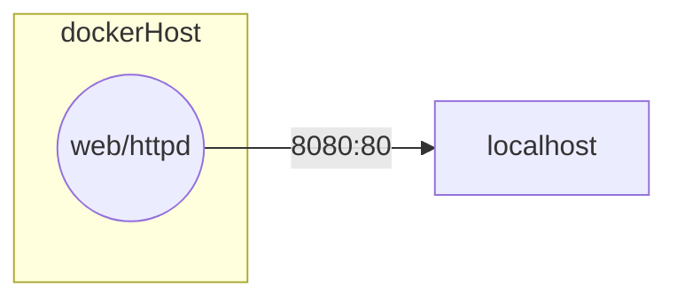

# Projet MiniInsta Conteneurisé

Le projet miniINSTA n'avait pas encore de BDD SQL, il exécutait simplement du PHP et créait des fichiers si quelqu'un téléversait une image.

Il nous faut donc simplement une image qui contient PHP et un serveur web.

Schéma réseau de l'application

*Schéma réseau de l'application :*

## Repo du projet si besoin :

https://github.com/CHAOUCHI/projet-miniinsta-correction.git

# Cahier des charges

|Tâches|Description|Détails|
|-|-|-|
|1. Documenter le lancement de l'application|Documenter le lancement de l'application sur la machine locale (localhost) en indiquant les ports TCP que l'application écoute (*listen*).|
|2. Conteneuriser l'application avec Docker|Créer un Dockerfile pour construire une image de l'application.|
|3. L'utilisateur doit pouvoir accéder à l'application via localhost|L'application doit être accessible via localhost:8080 (ou un autre port de votre choix) après avoir lancé le conteneur Docker.|APPELEZ-MOI POUR QUE JE VÉRIFIE|
|4. BONUS|Utilisez les identifiants SSH du stage Marsai pour héberger le container sur whiletrue.fr|Donc si vous exposez sur 8080, ce sera whiletrue.fr:8080 (attention à ne pas prendre un port déjà utilisé par un collègue)|