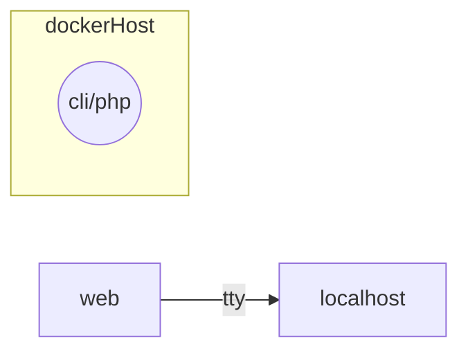

# Quizz CLI

La conteneurisation du quizz en CLI est particulière car elle ne repose pas sur l'exposition de ports TCP pour permettre aux utilisateurs d'accéder à l'application, mais plutôt sur l'exécution d'une commande dans le terminal pour interagir avec l'application.

***Voilà pourquoi ce projet est en BONUS : vous n'êtes pas obligés de le faire.***

## Schéma réseau de l'application :

# Cahier des charges

|Tâches|Description|Détails|
|-|-|-|
|1. Documenter le lancement de l'application|Documenter le lancement de l'application sur la machine locale (localhost) en indiquant les ports TCP que l'application écoute (*listen*).|
|2. Conteneuriser l'application avec Docker|Créer un Dockerfile pour construire une image de l'application.|
|3. L'utilisateur doit pouvoir accéder à l'application en ligne de commande grâce à la commande suivante :|`docker run -it quizz`|

Documentation de `-it` : https://docs.docker.com/engine/reference/run/#options

- `-i` : permet d'exécuter le conteneur en mode interactif, c'est-à-dire que le terminal de la machine hôte (localhost) est connecté au terminal du conteneur, ce qui permet d'interagir avec le conteneur en temps réel.
- `-t` : permet d'allouer un pseudo-terminal (tty) pour le conteneur, ce qui permet d'avoir une interface de ligne de commande plus conviviale et de pouvoir utiliser des commandes interactives à l'intérieur du conteneur.

