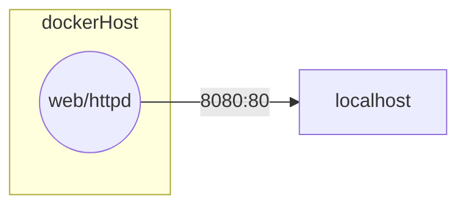

# Projet Twelve-Projet Conteneurisé

Schéma réseau de l'application

*Schéma réseau de l'application :*

> Lien du projet déjà dockerisé : http://whiletrue.fr:1212/

# Repo du projet si besoin :
https://github.com/CHAOUCHI/twelve-projects-dom.git

# Cahier des charges

|Tâches|Description|Détails|
|-|-|-|
| 1. Documenter les dépendances du projet Tasklist | |
| 2. Conteneuriser l'application avec Docker | |
| 3. L'utilisateur doit pouvoir accéder à l'application via localhost | L'application doit être accessible via localhost:1212 (ou un autre port de votre choix) après avoir lancé le conteneur Docker.|APPELEZ-MOI POUR QUE JE VÉRIFIE|
| 4. BONUS | Utilisez les identifiants SSH du stage marsai pour héberger le conteneur sur whiletrue.fr|Donc si vous exposez sur 8080, ce sera whiletrue.fr:8080 (attention à ne pas prendre un port déjà utilisé par un collègue)|