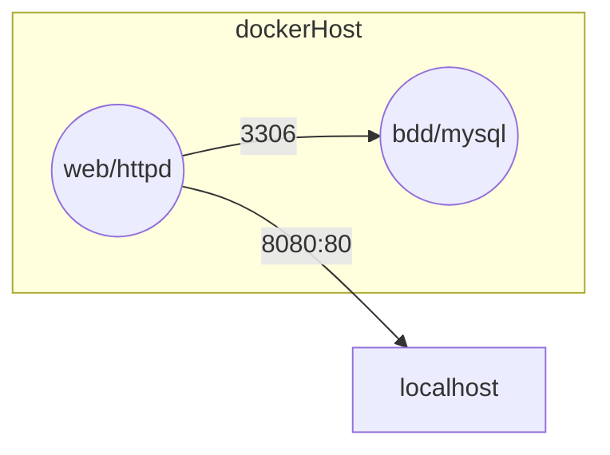

# Projet ThreadFullStack Contenerisé

Schéma réseau de l'application

*Schéma réseau de l'application :*

# Cahier des charges

|Tâches|Description|Details|
|-|-|-|
| 1. Documenter les dépendences du projet ThreadFullStack | npm,node,apache |
| 2. Conteneuriser l'application avec docker compose |
| 3. L'utilisateur doit pouvoir accéder à l'application via localhost | L'application doit être accessible via localhost:1212 (ou un autre port de votre choix) après avoir lancé le conteneur Docker.|APPELLEZ MOI POUR QUE JE VERIFIE|
| 4. BONUS | Utilisez les identifiants ssh du stage marsai pour héberger le container sur whiletrue.fr|Donc si vous exposé sur 8080 ce sera whiletrue.fr:8080 (attention a ne pas prendre un port déjà utilisez par un collègue)|

