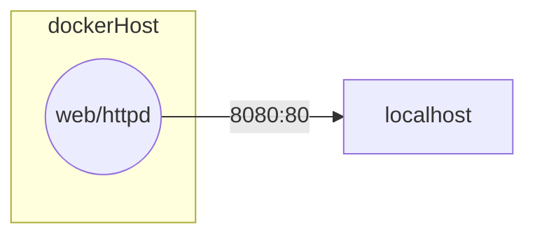

# Projet TasklistSPA Contenerisé

<details>
<summary>Schéma réseau de l'application</summary>

*Schéma réseau de l'application :*

</details>


## A savoir avant de commencer

Il est possible de mettre plusieurs FROM dans un même Dockerfile, on appelle ça le multi-stage build.

Par exemple pour une application react j'ai besoin de la complier avec npm :
```bash
npm run build
```
Puis de copié collé le dossier dist ainsi généré dans une image apache pour servir le contenu statique.

> le dossier dist contient le index.html et les fichiers js/css générés par react après compilation.

Je doit donc utiliser la syntaxe du multistage build pour commencer le build dans une image node, puis copier le résultat dans une image apache.
```Dockerfile
FROM node AS build
WORKDIR /app
COPY . .
RUN npm install && npm run build

FROM httpd:2.4
COPY --from=build /app/build /usr/local/apache2/htdocs/
```

> `FROM node AS build` : on utilise l'image node pour faire le build de l'application, et on lui donne un alias `build` pour pouvoir y faire référence plus tard.
> `COPY --from=build /app/build /usr/local/apache2/htdocs/` : on copie le dossier build généré par react dans le dossier de l'image apache qui sert les fichiers statiques. Docker va copié collé depuis l'image précedente plutôt que depuis le host machine comme il fait habituellement.

# Cahier des charges

|Tâches|Description|Details|
|-|-|-|
| 1. Documenter les dépendences du projet TasklistSPA | npm,node,apache |
| 2. Conteneuriser l'application avec docker |
| 3. L'utilisateur doit pouvoir accéder à l'application via localhost | L'application doit être accessible via localhost:1212 (ou un autre port de votre choix) après avoir lancé le conteneur Docker.|APPELLEZ MOI POUR QUE JE VERIFIE|
| 4. BONUS | Utilisez les identifiants ssh du stage marsai pour héberger le container sur whiletrue.fr|Donc si vous exposé sur 8080 ce sera whiletrue.fr:8080 (attention a ne pas prendre un port déjà utilisez par un collègue)|