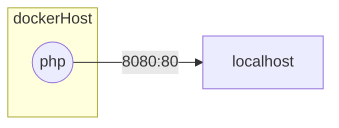

# Dockeriser le projet Symfony Tasklist Reloaded

La dockerisation d'un projet Symfony est plus ou moins automatique car :
- Symfony Recipes et Composer écrivent eux-mêmes les docker compose pour les dépendances du projet
- La documentation de Symfony indique comment dockeriser la partie PHP du framework grâce au dépôt de `dunglas` qui est l'un des mainteneurs de Symfony.

1. Lisez les documentations suivantes pour comprendre comment dockeriser un projet Symfony :
- Symfony Docker : https://github.com/dunglas/symfony-docker
- Dockeriser un projet existant : https://github.com/dunglas/symfony-docker/blob/main/docs/existing-project.md

2. Finissez de conteneuriser le projet Tasklist Reloaded

3. Mettez-le en ligne sur mon serveur Hostinger avec les identifiants SSH de marsai

## Schéma réseau de l'application :

> Si vous utilisez PostgreSQL plutôt que SQLite, il vous faudra ajouter un conteneur pour la base de données pour faire communiquer les deux conteneurs entre eux.

