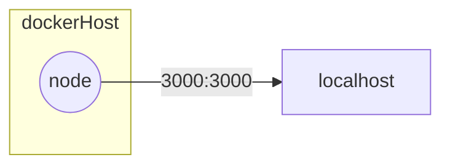

## Le workflow de Docker

1. **Développement** : Les développeurs codent l'application
2. **Documentation** : Les développeurs écrivent de la documentation pour expliquer comment lancer l'application ainsi que les ports TCP qu'elle écoute (*listen*).
3. **Build** : Le DevOps écrit un *DockerFile*, un fichier texte qui copie le code source et définit les commandes Linux à exécuter pour lancer l'application.
4. **Run** : Le DevOps exécute le conteneur sur le serveur en précisant les ports TCP à ouvrir pour que les utilisateurs puissent accéder à l'application.

## Exemple de conteneurisation d'une API REST nodejs

### 1. **Développement** : Les développeurs codent l'application

*projet/app.js*
```js
const express = require('express');
const app = express();

const PORT = process.env.PORT || 3000; // par défaut le port est 3000 mais on peut le configurer via une variable d'environnement

app.get('/', (req, res) => {
  res.json({ message: "Hello je suis une api rest qui attend d'être conteneurisée !" });
});

app.listen(PORT, () => {
  console.log(`Example app listening on port ${PORT}!`);
});
```

### 2. **Documentation** : Les développeurs écrivent de la documentation pour expliquer comment lancer l'application ainsi que les ports TCP qu'elle écoute (*listen*).

*La documentation du déploiement de l'application respecte souvent le même schéma :*
```
## Prérequis (requirements)
## Installation des dépendances (dependencies)
## Lancement de l'application (run)
```

> **Note :** Documenter le déploiement d'une application est obligatoire pour le passage du titre DWWM (*cf. REAC DWWM 2023*)

#### Prérequis (requirements)
1. Node.js version 18 ou supérieure
2. npm 
#### Installation des dépendances (dependencies)

1. Rendez-vous à la racine du projet
```bash
cd projet
``` 

2. Installer les dépendances nodejs
  
```bash
npm install
```
#### Lancement de l'application (run)


3. Lancer l'application
```bash
node app.js
```

Voilà, on a bien documenté le lancement de notre application, on peut maintenant passer à l'étape suivante : la conteneurisation de l'application avec Docker.


### 3. **Build** : Le DevOps écrit un *DockerFile*, un fichier texte qui copie le code source et définit les commandes Linux à exécuter pour lancer l'application.


À présent, il est temps de créer un fichier *DockerFile*, concrètement c'est un script qui contient les commandes Linux à exécuter pour construire l'image de notre application.

**Image docker**: Une image est un template à partir duquel on peut créer des conteneurs, elle contient tout ce dont l'application a besoin pour fonctionner (code source, dépendances, configurations).

Pour construire une image, j'ai besoin de choisir une autre image qui sert de base. Souvent on utilise `alpine` Linux qui est une distribution Linux légère. 

Dans notre cas on a besoin de `nodejs` et `npm` pour faire tourner notre application, on va donc choisir l'image officielle `node:18`, **qui est effectivement basée sur Alpine**, mais qui **contient déjà nodejs et npm pré-installés**.

> ***Important à savoir*** : Prendre une image contenant déjà ce qu'il faut évite d'écrire des commandes `apt install` qui vont ralentir le processus de création de l'image et l'alourdir.

1. Créer un fichier `DockerFile` à la racine du projet
*projet/DockerFile*
```Dockerfile
# 1. On part d'une image de base qui contient déjà nodejs
FROM node:18
# 2. On copie le code source de notre application dans le conteneur
COPY . /app
# 3. On se place dans le dossier de l'application
WORKDIR /app
# 4. On installe les dépendances de l'application
RUN npm install
# 5. On ouvre le port 3000 du container pour que les utilisateurs puissent accéder à l'application
EXPOSE 3000
# 6. On définit la commande à exécuter pour lancer l'application
ENTRYPOINT ["node", "app.js"]
```

En résumé, mon application ressemble à ça :


2. Construire l'image Docker et la nommer, ici on la nomme `jolieapidebilly` mais vous pouvez lui donner le nom que vous voulez.
```bash
docker build -t jolieapidebilly .
```

#### La syntaxe d'un DockerFile

> Lisez la doc pour plus d'infos sur les commandes Dockerfile existantes : https://docs.docker.com/reference/dockerfile/

Description des commandes :
- `FROM` : Un DockerFile commence TOUJOURS par la commande `FROM` qui indique une image existante sur DockerHub à utiliser comme base pour construire notre image.
- `COPY` : La commande `COPY` permet de copier des fichiers ou des dossiers de notre machine locale vers le conteneur.
- `WORKDIR` : La commande `WORKDIR` permet de se placer dans un dossier du conteneur, c'est comme si on faisait un `cd` dans le terminal.
- `RUN` : La commande `RUN` permet d'exécuter une commande Linux dans le conteneur, dans notre cas on l'utilise pour installer les dépendances de notre application.
- `EXPOSE` : La commande `EXPOSE` permet d'indiquer le port TCP à exposer vers l'extérieur de Docker, en effet **par défaut les ports d'une application conteneurisée ne sont pas accessibles depuis l'extérieur du conteneur, il faut les exposer pour que les utilisateurs puissent y accéder.**
- `ENTRYPOINT` : La commande `ENTRYPOINT` permet de définir à l'avance la commande à exécuter pour lancer l'application, **c'est la commande qui sera exécutée lorsque le conteneur sera lancé** (la commande exécutée par `docker run` donc).

> `CMD` ou `ENTRYPOINT` ? : On peut utiliser les deux, mais la différence est que `CMD` peut être écrasé par la commande passée à `docker run`, tandis que `ENTRYPOINT` ne peut pas être écrasé, c'est pourquoi on utilise souvent `ENTRYPOINT` pour les applications qui doivent toujours être lancées de la même manière.
> *Exemple*:
> ```bash
> # avec CMD, la commande echo hello écrase la commande node app.js, l'application ne se lance pas
> docker run -p 3000:3000 my-image echo hello 
> # avec ENTRYPOINT, la commande node app.js est exécutée même si on ne la précise pas dans la commande docker run
> docker run -p 3000:3000 my-image
> ```

### 4. **Run** : Le DevOps exécute le conteneur sur le serveur en précisant les ports TCP à ouvrir pour que les utilisateurs puissent accéder à l'application.

Pour exécuter un conteneur il faut utiliser la commande `docker run` en précisant les arguments suivants :
- `-p` : pour exposer les ports TCP de l'application vers l'extérieur du conteneur, la syntaxe est `-p <port_extérieur>:<port_intérieur>`, dans notre cas on veut exposer le port 3000 de l'application vers le port 3000 de notre machine locale, donc on utilise `-p 3000:3000`.
- `--name` : pour donner un nom à notre conteneur, c'est plus facile de gérer les conteneurs avec des noms plutôt que des IDs générés aléatoirement, dans notre cas on va nommer notre conteneur `jolieapidebilly` pour faire simple.

1. Lancer le conteneur

```bash
docker run -p 3000:3000 --name api-billy jolieapidebilly
```

2. Tester la route *http://localhost:3000* dans *Postman*, le navigateur ou avec la commande *curl* pour vérifier que notre application fonctionne correctement

