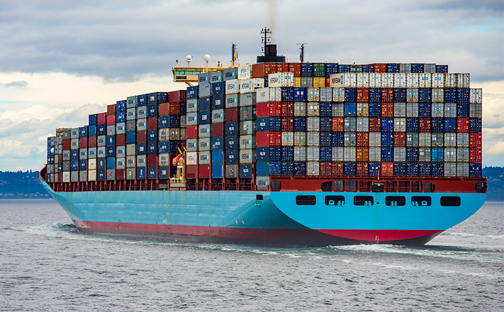

# Docker
Docker est un outil de conteneurisation qui permet de créer, déployer et exécuter des applications dans des conteneurs. Un conteneur est une unité légère et portable qui contient tout ce dont une application a besoin pour fonctionner, y compris le code, les bibliothèques, les dépendances et les configurations.

## Avant docker Serveur Physique et VM

### Serveur Physique

Au départ, les applications étaient déployées sur des serveurs physiques.

Chaque application etait coder pour l'OS du serveur (windows ou linux) et les dépendances de l'application devaient être installées manuellement sur le serveur.

Quand une application devait être déployée sur un autre serveur, il fallait réinstaller les dépendances et configurer l'application pour le nouvel environnement.

Quand une application devait être mise à jour, il fallait arrêter le serveur, faire les modifications, puis redémarrer le serveur.

Quand une application plantait, elle avait tendance à faire planter le serveur entier, affectant ainsi les autres applications hébergées sur le même serveur.

Cette solution entraine donc des soucis :
- Difficulté de déploiement (environnement de production différent de l'environnement de développement)
- Difficulté de mise à jour (Application indisponible pendant la mise à jour)
- Difficulté de resolution de problèmes (Plantage de l'application affectant le serveur entier)

### VM (Virtual Machine)

On à donc par la suite inventé les machines virtuelles (VM) pour résoudre ces problèmes.

Une machine virtuelle est un environnement d'exécution isolé qui fonctionne sur un hyperviseur. Chaque VM a son propre système d'exploitation, ses propres ressources (CPU, mémoire, stockage) et peut **exécuter des applications de manière indépendante**.

Cependant, les VM ont aussi leurs inconvénients :
- Elles sont **lourdes en termes de ressources** (CPU, mémoire, stockage) car chaque VM nécessite un **système d'exploitation complet**.
- Elles sont **lentes à redémarrer et à arrêter**, ce qui peut entraîner des temps d'arrêt prolongés lors du déploiement ou de la mise à jour des applications.
- Les applications sont toujours **dépendantes de l'OS** de la VM, car l'environnement de dev et de production sont différents, ce qui peut entraîner des problèmes de compatibilité.

Docker résout ces problèmes :

|Problèmes|Serveur Physique|VM|Docker|
|-|-|-|-|
|lourdes en termes de ressources|Oui|Oui|Non|
|Dépendance à l'OS|Oui|Oui|Non|
|Isolation des applications|Non|Oui|Oui|
|Redémarrage rapide|Non|Non|Oui|

## Arrivée de Docker

En 2010 Solomon Hykes un ingénieur franco-américain à crée Docker une solution pour simplifier le déploiment et la développement d'application en s'inspirant du concept de *conteneur de fret*.

> *"Solomon Hykes met en avant un concept, Docker, transposant à l’industrie du logiciel l’idée du conteneur[3] qui a révolutionné l’industrie du transport. Le concept est issu d’une recherche d’efficacité dans le développement de logiciels et dans leur déploiement, indépendamment des contextes d'exécution."* 
*source : https://fr.wikipedia.org/wiki/Solomon_Hykes*

Un conteneur de fret est une unité de transport standardisée qui peut être facilement déplacée d'un mode de transport à un autre (navire, train, camion) sans nécessiter de déchargement et de rechargement du contenu. De la même manière, Docker permet de créer des conteneurs logiciels qui peuvent être facilement déplacés d'un environnement à un autre (développement, test, production) sans nécessiter de modifications du code ou des dépendances.

## Le workflow de Docker

1. **Développement** : Les développeurs code l'application
2. **Documentation** : Les développeurs écrivent de la documentation pour expliquer comment lancer l'application ainsi que les ports TCP qu'elle écoute (*listen*).
3. **Build** : Le DevOps écrit un *DockerFile*, un fichier texte qui copie le code source et défini les commandes linux a executer pour lancer l'application.
4. **Run** : Le DevOps execute le conteneur sur le serveur en précisant les ports TCP à ouvrir pour que les utilisateurs puissent accéder à l'application.

> Retenez bien ces étapes, c'est le workflow de base de Docker !

## Mise en pratique

1. Rendez-vous dans le dossier `Cours/Getting Started-APi REST` pour apprendre à dockeriser une api rest