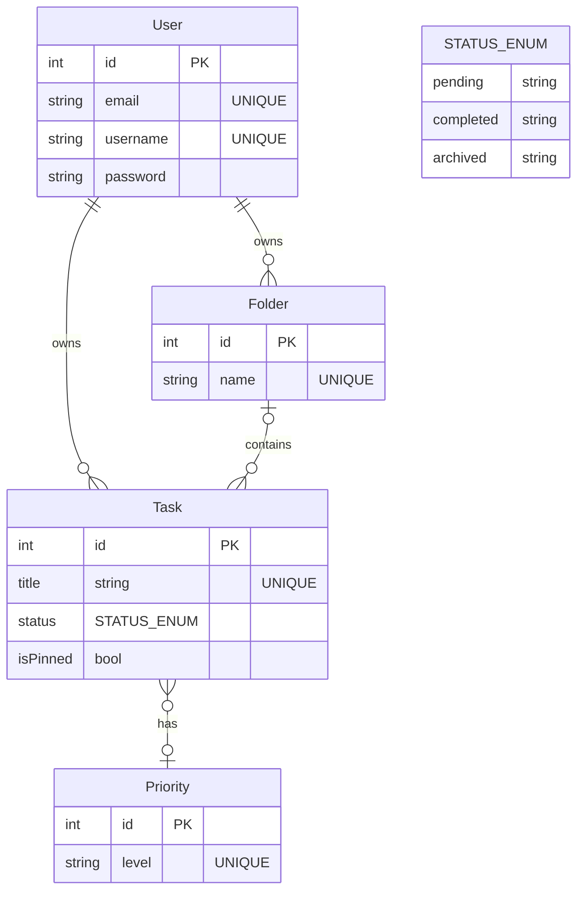

<!--
Todo 
Critères d'acceptation
 -->

## Objectif pédagogique : Maîtriser le CRUD, les relations simples et l'authentification.

## Epic 1 : Gestion des tâches

- User Story 1 : En tant qu'utilisateur, je veux créer une tâche avec un titre et une priorité afin d'organiser ma journée.
    - CA 1 : L'utilisateur peut créer ses propres prioritées
    - CA 2 : Les prioritées disponibles par défaut sont : "urgent", "important", "normal"

- User Story 2 : En tant qu'utilisateur, je veux marquer le status d'une tâche comme terminée afin de suivre mon avancement.
    - CA 1 : Une tache peut avoir les status suivants : "en cours", "terminée", "archivé"
    - CA 2 : Les tâches archivées se retrouve à la fin de la liste des tâches.
    - CA 2 : Les tâches terminées se retrouve juste avant les tâches archivées et leurs titres est marquée barré
    - CA 4 : Les tâches en cours apparaissent juste avant les tâches terminées dans la liste des tâches

- User Story 3 : En tant qu'utilisateur, je veux épingler mes tâches les plus importantes afin qu'elles restent visibles en haut de ma liste.
    - CA 1 : Je clique sur l'icone épingle d'une tache pour l'épingler

- User Story 4 : En tant qu'utilisateur, je veux pouvoir m'inscrire et me connecter afin d'accéder à mes tâches personnelles.
    - CA 1: L'utilisateur peut s'inscrire avec un email, un nom d'utilisateur et un mot de passe.
    - CA 2: L'utilisateur peut se connecter avec son email et son mot de passe.
    - CA 3: Les mots de passe sont stockés de manière sécurisée (par exemple, avec un hash).

## Epic 2 : Organisation & Tri

- User Story 1 : En tant qu'utilisateur, je veux créer des dossiers thématiques afin de regrouper mes tâches par projet.
    - CA 1 : Un dossier créer doit être nommée
    - CA 2 : Je peut associée une couleur à un dossier.

- User Story 2 : En tant qu'utilisateur, je veux filtrer mes tâches par statut ou par priorité afin de me concentrer sur l'essentiel.
    - CA 1 : Je peut filtrer les taches par statut (en cours, terminée, archivé)
    - CA 2 : Je peut filtrer les taches par priorité (urgent, important, normal)

## Maquette

Maquette interactive :
https://www.figma.com/proto/O1CFvazkgkjUsdGpVpozRj/Untitled?node-id=4-823&t=S5RtpiUl6nNUacow-1&scaling=min-zoom&content-scaling=fixed&page-id=0%3A1&starting-point-node-id=4%3A823&show-proto-sidebar=1

## UML

### EntityRelation
