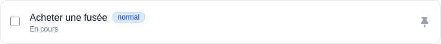

## Security
<!-- Il faut que je retravail ce cours -->
### Authentification
> Doc : https://symfony.com/doc/current/security.html

L'authentification permet de mettre en place un système d'inscription et de connexion d'utilisateurs. Symfony fournit des commandes pour générer automatiquement les entités, formulaires et contrôleurs nécessaires.

Les commandes à retenir :
```bash
symfony console make:user
symfony console make:registration-form
symfony console make:security:form-login
```

1. Créer l'entité User avec la commande `make:user`
```bash
symfony console make:user
```

2. Effectuer la migration pour créer la table `user` dans la base de données
```bash
symfony console make:migration
symfony console doctrine:migrations:migrate
```

3. Générer un formulaire d'inscription
```bash
symfony console make:registration-form
```

4. Générer un formulaire de connexion avec authentification
```bash
symfony console make:security:form-login
```

Et voilà après avoir fait ces étapes, vous avez un système d'authentification complet avec inscription, connexion et déconnexion. 


Vous pouvez maintenant accéder à la page d'inscription à l'adresse `http://localhost:8000/register` et à la page de connexion à l'adresse `http://localhost:8000/login`.

Le plus souvent juste après ces commandes vous :
1. Modifier éventullement les champs des formulaires dans le fichier `src/Form/RegistrationFormType.php`
> Voir la doc des paramètre de la méthode add du FormBuilder : https://symfony.com/doc/current/reference/forms/types.html#reference-forms-types-options
```php
<?php

namespace App\Form;

use App\Entity\User;
use Symfony\Component\Form\AbstractType;
use Symfony\Component\Form\Extension\Core\Type\CheckboxType;
use Symfony\Component\Form\Extension\Core\Type\PasswordType;
use Symfony\Component\Form\Extension\Core\Type\TextType;
use Symfony\Component\Form\FormBuilderInterface;
use Symfony\Component\OptionsResolver\OptionsResolver;
use Symfony\Component\Validator\Constraints\IsTrue;
use Symfony\Component\Validator\Constraints\Length;
use Symfony\Component\Validator\Constraints\NotBlank;

class RegistrationFormType extends AbstractType
{
    public function buildForm(FormBuilderInterface $builder, array $options): void
    {
        $builder
            ->add('email', null, [
                // Je configure le champ email pour qu'il soit requis et pour ajouter un placeholder qui corresponde à la maquette Figma
                'required' => true,
                'attr' => [
                    'placeholder' => 'votre@email.com',
                ],
            ])
            ->add('username', null, [
                'required' => true,
                'attr' => [
                    // Je configure le placeholder pour qu'il corresponde à la maquette Figma
                    'placeholder' => 'nom_utilisateur',
                ],
            ])
            ->add('agreeTerms', CheckboxType::class, [
                'mapped' => false,
                'constraints' => [
                    new IsTrue(
                        message: 'You should agree to our terms.',
                    ),
                ],
            ])
            ->add('plainPassword', PasswordType::class, [
                // instead of being set onto the object directly,
                // this is read and encoded in the controller
                'mapped' => false,
                'attr' => [
                    'autocomplete' => 'new-password',
                    'placeholder' => '************',
                    ],
                'constraints' => [
                    new NotBlank(
                        message: 'Please enter a password',
                    ),
                    new Length(
                        min: 6,
                        minMessage: 'Your password should be at least {{ limit }} characters',
                        // max length allowed by Symfony for security reasons
                        max: 4096,
                    ),
                ],
            ])
        ;
    }

    // ...
}
```

### Authorization
> Doc : https://symfony.com/doc/current/security.html#authorization
> Créer des rôles : https://symfony.com/doc/current/security.html#hierarchical-roles
> 

L'autorisation permet de définir qui a accès à quelles routes en fonction de son rôle. Symfony utilise deux concepts : le **Firewall** et l'**Access Control**.

**Firewall** : configure comment les utilisateurs se connectent (formulaire, API token, etc)

La plupart le firewall est auto-configuré par la commande make:user, make:registration-form et make:security:form-login. Voici les paramètres les plus importants à connaître :

- `form_login` : utilise un formulaire de connexion
- `default_target_path` : page de redirection après la connexion
- `login_path` : route vers la page de connexion
- `check_path` : route qui traite la soumission du formulaire
- `logout` : configure la déconnexion

```yaml
security:
    # ...
    # ...
    # ...
    firewalls:
        dev:
            # ...
        main:
            lazy: true
            provider: app_user_provider
            form_login:
                login_path: app_login
                check_path: app_login
                # La page par défaut après la connexion
                # pour rediriger l'utilisateur au dashboard après la connexion
                default_target_path: app_dashboard
                enable_csrf: true
            logout:
                path: app_logout
                # where to redirect after logout
                target: app_login

            # Activate different ways to authenticate:
            # https://symfony.com/doc/current/security.html#the-firewall

            # https://symfony.com/doc/current/security/impersonating_user.html
            # switch_user: true

    # Note: Only the *first* matching rule is applied
    access_control:
        - { route: app_dashboard, roles: ROLE_USER }
        # - { path: ^/admin, roles: ROLE_ADMIN }

```

**Access Control** : définit les rôles requis pour accéder à certaines routes
> Doc : https://symfony.com/doc/current/security.html#allowing-unsecured-access-i-e-anonymous-users

Il faut que vous modifiez le fichier `config/packages/security.yaml` pour ajouter des règles d'accès en fonction des rôles. Par exemple, pour restreindre l'accès à la route `/admin` aux utilisateurs ayant le rôle `ROLE_ADMIN`, et l'accès à la route `/dashboard` aux utilisateurs ayant le rôle `ROLE_USER`, vous pouvez faire comme suit :

```yaml
# config/packages/security.yaml
access_control:
    - { path: ^/admin, role: ROLE_ADMIN }
    - { path: ^/dashboard, role: ROLE_USER }
```

### Protection CSRF
> Doc : https://symfony.com/doc/current/security/csrf.html

CSRF (Cross-Site Request Forgery) est une vulnérabilité de sécurité. Symfony génère automatiquement des tokens CSRF dans les formulaires.

**Formulaires automatiques avec make:form**
```bash
symfony console make:form UserFormType
```
Le token CSRF est généré automatiquement.

**Formulaires manuels**
Ajouter le token CSRF dans le template :
```html
<input type="hidden" name="_token" value="{{ csrf_token('form_name') }}">
```

Vérifier le token dans le contrôleur :
```php
if (!$this->isCsrfTokenValid('form_name', $token)) {
        throw $this->createAccessDeniedException('Invalid CSRF token');
}
```


- CSRF Formulaire sécurisé. Si vous modifier une donnée via un lien cliquable ou un formulaire vous etes exposée à une attaque CSRF (Cross Site Resources Forgery) qui permet à un attaquant de faire une requete sur votre site sans même que ce dernier soit sur votre site web. Le plus souvent, les attaques CSRF sont effectuées via des formulaires cachés sur d'autres sites internet scam qui redirigent vers une route de votre application.

Concerètement, prennont un formulaire qui permet de valider une tâche :
```html
    <form action="{{path('app_task_done',{id : id})}}" method="post">
        <input type="checkbox" onclick="this.form.submit()" {{ this.isDone ? "checked" : "" }} name="is_done" id="is_done" class=" w-4 h-4 bg-[#F3F3F5] border border-black/10 rounded-sm">
        <button class="btn"></button>
    </form>
```
*La tâche avant le clique sur la checkbox de validation*


Pour valider une tâche il suffit à l'utilisateur :
1. De ce connectée au site web (démarrage de la session donc)
2. De cliquer sur le bouton pour soumètre le formulaire à la route `POST /task/2/done`

Et ainsi la tâche est modifier dans la base de donnée ! Rien de plus simple.
*La tâche validée après l'envoie du formulaire à la route *


Maintenant une question se pose : "Si un autre site internet  ecrit contient lui aussi un formulaire qui redirige vers la route `http://localhost:8000/task/2/done` est ce que celà va fonctionner ?

La réponse est oui !

```html
<form action="http://localhost:8000/task/2/done" method="post">
    <input type="checkbox" onclick="this.form.submit()" name="is_done">
    <button class="btn"></button>
</form>
```

Ce formulaire peut être placé sur n'importe quel site internet, et **tant que l'utilisateur c'est déjà connecté à votre application**, il peut soumettre ce formulaire et ainsi modifier les données de votre application sans même être sur votre site web ! C'est ce qu'on appelle une attaque CSRF.

Pour éviter ce genre d'attaque, Symfony utilise un système de token CSRF. Lorsque vous créez un formulaire avec Symfony, un token CSRF est automatiquement généré et ajouté au formulaire. Ce token est unique pour chaque session utilisateur et est vérifié à chaque soumission de formulaire. Si le token n'est pas présent ou est invalide, la soumission du formulaire est rejetée.

C'est le cas des formlaires crée avec les helpers fonctions form(), form_start(), form_end() de twig. **Mais si vous crée une formulaire à la main, vous devez ajouter le token CSRF manuellement.**

***La solution*** : Ajouter un champ caché dans votre formulaire qui contient le token CSRF généré par Symfony. Vous pouvez générer ce token dans votre contrôleur et le passer à votre template Twig, puis l'inclure dans votre formulaire, grâce à la fonction `csrf_token()` dans Twig comme suit :
```html
<form action="{{path('app_task_done',{id : id})}}" method="post">
    
    <input type="hidden" name="token" value="{{ csrf_token('task_done') }}">

    <input type="checkbox" onclick="this.form.submit()" {{ this.isDone ? "checked" : "" }} name="is_done" id="is_done" class=" w-4 h-4 bg-[#F3F3F5] border border-black/10 rounded-sm">
    <button class="btn"></button>
</form>
```


### Injection de dépendances dans un contrôleur
> Doc : https://symfony.com/doc/current/controller.html#accessing-services

Injecter différents services dans les méthodes d'un contrôleur :

**Request** : accéder aux données de la requête HTTP
```php
use Symfony\Component\HttpFoundation\Request;

// missing class

public function example(Request $request): Response
{
        $data = $request->getPayload()->get('field_name');
}
```

**CurrentUser** : accéder à l'utilisateur connecté

> Doc : https://symfony.com/doc/current/security.html#fetching-the-user-object

```php
use Symfony\Bundle\SecurityBundle\Security;

public function dashboard(Security $security): Response
{
        $user = $security->getUser();
}
```
// missing exemple with #[CurrentUser()] User $user

**LoggerInterface** : enregistrer des logs (équivalent de console.log en JavaScript)
```php
use Psr\Log\LoggerInterface;
// missing class
public function example(LoggerInterface $logger): Response
{
        $logger->info('Message informatif');
        $logger->error('Message d\'erreur');
}
```

**EntityManager** : gérer les entités
```php
use Doctrine\ORM\EntityManagerInterface;

public function example(EntityManagerInterface $entityManager): Response
{
        // utiliser entityManager
        // missing getRepository, persist, flush
}
```

**Repository** : alternative à EntityManager pour récupérer des données
```php
use App\Repository\UserRepository;

public function example(UserRepository $userRepository): Response
{
        $users = $userRepository->findAll();
}
```

### Composants Twig réutilisables
> Doc : https://symfony.com/bundles/ux-twig-component/current/index.html

Les composants Twig permettent de créer des composants réutilisables (comme en React).

Générer un composant Twig :
```bash
symfony console make:twig:component Alert
```

Un composant possède des propriétés publiques et des méthodes getter :
```php
// src/Components/Alert.php
namespace App\Components;

use Symfony\UX\TwigComponent\Attribute\AsTwigComponent;

#[AsTwigComponent]
final class Alert
{
        public string $message = '';
        public string $type = 'info';
}
```

Utiliser le composant dans un template :
```html
<twig:Alert message="Bienvenue!" type="success" />
```