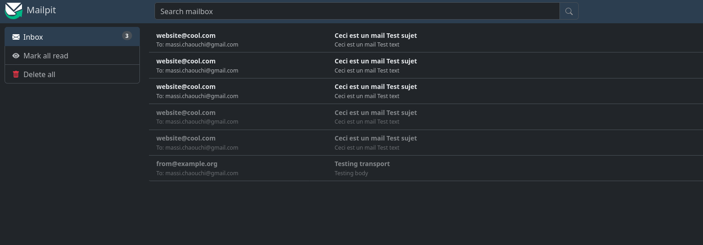

## Pré-requis

### Installation de symfony/mailer
1. Si ce n'est pas déjà fait, installer le composant Mailer de Symfony
```bash
composer require symfony/mailer
```

### Activation du mode synchrone pour envoyer les mails instantanément
2. Configurer l'envoi de mail synchrone dans packages/messenger.yaml
> Par défaut, Symfony Messenger place les mails dans une file d'attente et ne les envoie pas immédiatement.
> Pour envoyer les mails il faut vider la file d'attente en utilisant la commande :
> ```bash
> symfony console messenger:consume async
> ```
> Mais pour le développement il est plus pratique d'envoyer les mails immédiatement, voilà pourquoi je vous fais configurer le mode synchrone pour les mails.
> Retenez cependant qu'en production il faut utiliser le mode asynchrone pour de meilleures performances, aussi il est d'usage de mettre en place une tâche cron pour vider la file d'attente des mails toutes les heures ou tous les jours.
```yaml
framework:
    messenger:
        failure_transport: failed

        transports:
            # +++++++++
            sync: 'sync://'
            # https://symfony.com/doc/current/messenger.html#transport-configuration
            async:
                dsn: '%env(MESSENGER_TRANSPORT_DSN)%'
                retry_strategy:
                    max_retries: 3
                    multiplier: 2
            failed: 'doctrine://default?queue_name=failed'

        default_bus: messenger.bus.default

        buses:
            messenger.bus.default: []

        routing:
            # +++++++++ Modifier async vers sync pour utiliser le mode synchrone défini ci-dessus
            Symfony\Component\Mailer\Messenger\SendEmailMessage: sync
            Symfony\Component\Notifier\Message\ChatMessage: async
            Symfony\Component\Notifier\Message\SmsMessage: async

            # Route your messages to the transports
            # 'App\Message\YourMessage': async
```

### Configuration de la base de données pour stocker les mails
3. Symfony Mailer enregistre les mails dans la base de données, il est donc nécessaire d'avoir une base de données configurée et migrée pour pouvoir utiliser cette fonctionnalité.
```bash
symfony console doctrine:migrations:migrate
```

<!-- - Installer le client HTTP amphp qui est utilisé par Symfony Mailer pour envoyer les mails, c'est un client HTTP asynchrone qui permet d'envoyer les mails de manière performante.
```bash
composer require amphp/http-client:^5
``` -->

### Serveur SMTP de développement en localhost MailPit avec Docker
- Docker compose est aussi nécessaire pour faire tourner le container mailpit qui va nous permettre de recevoir et visualiser les mails envoyés par notre application en localhost, cela évite de configurer/payer un vrai serveur SMTP et d'envoyer de vrais mails pendant le développement.

Symfony a déjà écrit votre compose.override.yml pour faire tourner le container mailpit.
```bash
  mailer:
    image: axllent/mailpit
    ports:
      - "1025"
      - "8025"
    environment:
      MP_SMTP_AUTH_ACCEPT_ANY: 1
      MP_SMTP_AUTH_ALLOW_INSECURE: 1
```

4. Lancer le container mailpit
```bash
docker compose up
``` 

### Configurer le `.env` pour Mailpit
5. Pour finir, modifier le fichier .env pour configurer le DSN de mailer pour utiliser le container mailpit :
```bash
###> symfony/mailer ###
MAILER_DSN=smtp://localhost:33021
###< symfony/mailer ###
```
> `33021` est le port exposé par le container mailpit pour recevoir les mails, il est défini dans le fichier compose.override.yml
> Vérifiez le port bindé à 1025 dans Docker Desktop pour vérifier quel port est exposé sur votre machine.

## Envoi d'un mail
1. Ouvrez sur votre navigateur `localhost:46517` pour accéder à l'interface de mailpit qui vous permettra de visualiser les mails envoyés par votre application.

2. Dans un contrôleur, injecter le service `MailerInterface` et utilisez le constructeur `new Email()` pour fabriquer un email et la méthode `send()` pour envoyer un mail :
```php
<?php

namespace App\Controller;

use Symfony\Bundle\FrameworkBundle\Controller\AbstractController;
use Symfony\Component\HttpFoundation\Response;
use Symfony\Component\Mailer\MailerInterface;
use Symfony\Component\Mime\Email;
use Symfony\Component\Routing\Attribute\Route;

final class MailController extends AbstractController
{
    #[Route('/mail', name: 'app_mail')]
    public function index(MailerInterface $mailer): Response
    {
        $email = new Email();
        $email->from("website@cool.com")
            ->to("massi.chaouchi@gmail.com")
            ->subject("Ceci est un mail Test sujet")
            ->text("Ceci est un mail Test text");

        $mailer->send($email);


        return $this->render('mail/index.html.twig', [
            'controller_name' => 'MailController',
        ]);
    }
}
```

1. Recharger la page `localhost:8000/mail` pour déclencher l'envoi du mail, puis aller sur `localhost:46517` pour voir le mail reçu dans l'interface de mailpit.



## Envoyer un template twig
Doc : https://symfony.com/doc/current/mailer.html#html-content

Précédemment j'ai utilisé la méthode publique text de la classe Email pour envoyer du texte brut mais il est aussi possible d'envoyer un template twig en utilisant la méthode htmlTemplate de la classe Email :
```php
<?php

namespace App\Controller;

use Symfony\Bundle\FrameworkBundle\Controller\AbstractController;
use Symfony\Component\HttpFoundation\Response;
use Symfony\Component\Mailer\MailerInterface;
use Symfony\Component\Mime\Email;
use Symfony\Component\Routing\Attribute\Route;

final class MailController extends AbstractController
{
    #[Route('/mail', name: 'app_mail')]
    public function index(MailerInterface $mailer): Response
    {
        $email = new Email();
        $email->from("website@cool.com")
            ->to("massi.chaouchi@gmail.com")
            ->subject("Ceci est un mail Test sujet")
            ->htmlTemplate('dossier/vue.html.twig');

        $mailer->send($email);


        return $this->render('mail/index.html.twig', [
            'controller_name' => 'MailController',
        ]);
    }
}
```

