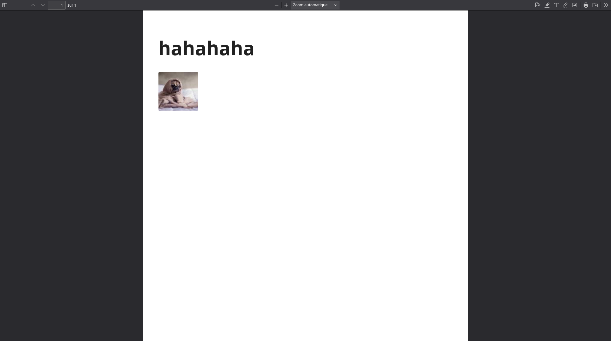
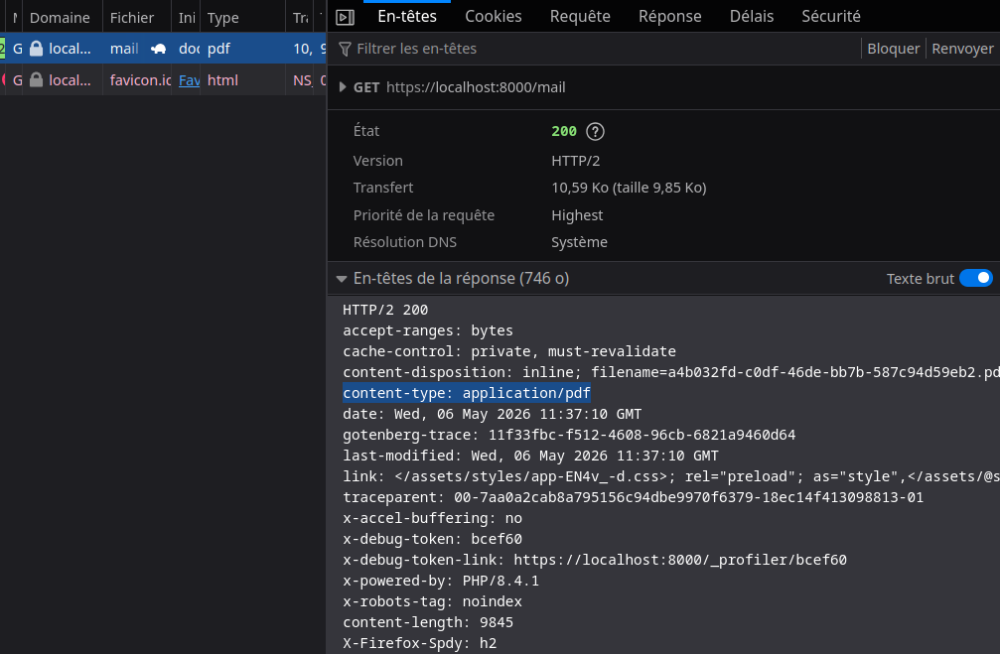
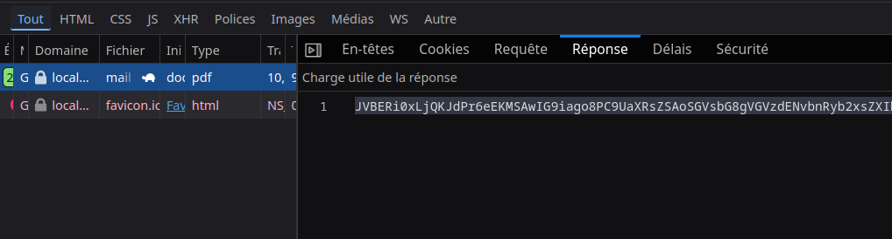

# Générer des PDF avec Symfony et Gotenberg API

## Documentation 
Le module Gotenberg est un bundle Symfony qui permet de générer des PDF à partir de templates twig, c'est idéal pour nous. Il est également très bien intégré à Symfony.

Doc : https://github.com/sensiolabs/GotenbergBundle

## Installation

1. Installer le bundle Gotenberg avec composer :
```bash
composer require sensiolabs/gotenberg-bundle
```


2. Vérifiez que Composer a bien mis à jour compose.override.yaml et compose.yaml pour ajouter le service Gotenberg :
```yaml
gotenberg:
    image: 'gotenberg/gotenberg:8'
    ports:
      - "3000:3000"
```

3. Configurez le port écouté par Symfony dans le fichier `.env`

```bash
###> sensiolabs/gotenberg-bundle ###
GOTENBERG_DSN=http://localhost:3000
###< sensiolabs/gotenberg-bundle ###
```


## Lancer le container Gotenberg avec Docker
Pour générer des PDF comme pour bien d'autres modules de PHP, il est parfois nécessaire d'installer des choses en plus du paquet composer. Il existe 3 moyens d'obtenir ces dépendances :
- Dépendance Système : installable avec apt (ex: php-pdo, php-curl, etc.)
- Dépendance PHP : installable avec composer (ex: symfony/mailer, etc.)
- Dépendance Dockerisée : la meilleure solution même si elle est plus coûteuse en ressources.

Il nous faut donc utiliser un container Gotenberg.


2. Lancer le container Gotenberg
```bash
docker compose up
```


## Créer un fichier PDF 
Pour créer un fichier PDF, il faut injecter le service `GotenbergPdfInterface` dans le contrôleur pour interagir avec le container Gotenberg.

Ici je vais pouvoir générer un PDF à partir d'un template twig. Pour cela, j'utilise la méthode `html()` du service `GotenbergPdfInterface` qui me retourne une instance de `HtmlRequest` qui me permet de configurer la génération de mon PDF.

> PDF, email, formulaire utilisent tous le même design pattern : le builder (le fait de construire un objet en appelant plusieurs méthodes à la suite).

```php
<?php

namespace App\Controller;

use Psr\Log\LoggerInterface;
use Sensiolabs\GotenbergBundle\GotenbergPdfInterface;
use Sensiolabs\GotenbergBundle\Processor\TempfileProcessor;
use Symfony\Bundle\FrameworkBundle\Controller\AbstractController;
use Symfony\Component\HttpFoundation\Response;
use Symfony\Component\Mailer\MailerInterface;
use Symfony\Component\Mime\Email;
use Symfony\Component\Mime\Part\DataPart;
use Symfony\Component\Mime\Part\File;
use Symfony\Component\Routing\Attribute\Route;

final class MailController extends AbstractController
{
    public function __construct(private LoggerInterface $logger){}

    #[Route('/mail', name: 'app_mail')]
    public function index(MailerInterface $mailer, GotenbergPdfInterface $gotenberg): Response
    {
       
        $filePdf = $gotenberg->html()
        ->content("test/index.html.twig")      // Je définis le template twig que je veux utiliser pour générer mon PDF
        ->processor(new TempfileProcessor())   // Je définis le processor que je veux utiliser pour générer mon PDF. Ici j'utilise le TempfileProcessor qui va créer un fichier temporaire pour stocker le PDF généré
        ->generate()                            // Je génère le PDF          
        ->process();                            // Je traite le PDF généré. Ici je récupère le fichier temporaire généré par le TempfileProcessor


        // MON FICHIER DOIT ÊTRE UNE VARIABLE DE TYPE resource.


        // Exemple : Do something with the file...
        // $email->attach($filePdf,"invoice.pdf");

        return $this->render('mail/index.html.twig', [
            'controller_name' => "haha controller",
        ]);
    }
}
```

> Souvenez-vous, le type resource est un type de variable qui représente une ressource externe, comme un fichier, une connexion à une base de données, etc. C'est un type de variable utilisé pour manipuler des ressources externes en PHP.
> On obtient ce type de variable en retour de la fonction `fopen()`.


## Le fichier PDF en temps que Réponse HTTP

L'api Gotenberg permet de fabriquer une réponse HTTP qui contient le PDF en body.

Je peux ansi retourner directement le pdf au clients.

`PDF` est un type mime reconnu par le protocole HTTP (`application/pdf`) au même titre que `applicaton/json`, `text/html`, etc.

Donc le client qui reçoit la réponse HTTP contenant le PDF dans le body peut l'afficher directement dans le navigateur ou le télécharger, etc.

> Envoyer directement le pdf dans le body d'une réponse permet de ne pas avoir à crer un fichier temporaire pour stocker le pdf généré on l'envoie directement au client, c'est plus rapide et plus léger en ressources.
> C'est la meilleure solution si on veut juste afficher le pdf dans le navigateur ou le télécharger (où meme le placer dans un iframe pour le prérendu ).

```php
<?php

namespace App\Controller;

use Psr\Log\LoggerInterface;
use Sensiolabs\GotenbergBundle\GotenbergPdfInterface;
use Sensiolabs\GotenbergBundle\Processor\TempfileProcessor;
use Symfony\Bundle\FrameworkBundle\Controller\AbstractController;
use Symfony\Component\HttpFoundation\Response;
use Symfony\Component\Mailer\MailerInterface;
use Symfony\Component\Mime\Email;
use Symfony\Component\Mime\Part\DataPart;
use Symfony\Component\Mime\Part\File;
use Symfony\Component\Routing\Attribute\Route;

final class MailController extends AbstractController
{
    public function __construct(private LoggerInterface $logger){}

    #[Route('/mail', name: 'app_mail')]
    public function index(MailerInterface $mailer, GotenbergPdfInterface $gotenberg): Response
    {
       
       // Une représentation objet du PDF généré
        $gotenbergPdfResult = $gotenberg->html()
        ->content("test/index.html.twig")     
        ->generate();      

        // La méthode stream() me retourne une réponse HTTP qui contient :
        // - le header Content-Type: application/pdf
        // - le body qui contient le contenu du PDF généré
        $httpResponse = $gotenbergPdfResult->stream();
        return $httpResponse;

    }
}
```

1. Rendez-vous sur `/mail` pour voir ce résultat :



2. Pour les plus curieux, ouvrez l'onglet réseau et observez les headers et le body de la réponse HTTP reçu (celle retournée par la méthode stream donc)

*Le header content-type ici surligné en bleu*


*Le body de la réponse*


