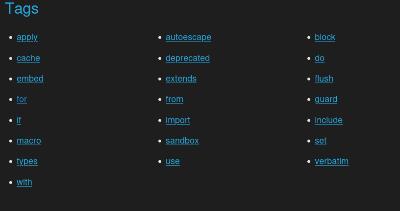

## View et Controller

En résumé :
- Créer une page : Controller et Route
```bash
symfony console make:controller HomeController
```
- Afficher des variables avec `{{ }}`
- Conditions et boucles avec ``, ``
- Héritage de templates avec `` et ``
- Générer des liens avec `path()`
- Rediriger avec `redirectToRoute()`
- Installer et compiler Tailwind


### Créer une page : Controller et Route
> Doc : https://symfony.com/doc/current/page_creation.html

Pour créer une page il faut :

1. Créer un controller si se n'est pas déjà
2. Ajouter des routes en ajoutant une nouvelle méthode à la classe Controller et en lui ajoutant un `PHP attribut`
3. Créez des fichiers .html.twig dans le dossier templates qui hérite du layout `base.html.twig`
4. Appeler la méthode `protected` `$this->render()`, cette méthode *return* une instance de la classe `Response` chose obligatoire pour tout route de votre application

*Créer un controller*
```bash
symfony console make:controller HomeController
```

*Ajout autant de routes que nécessaire*
```php
<?php

class HomeController extends AbstractControler
{
    // PHP attribut, une métadata qui permet à symfony d'identifier les routes de l'application
    /*
    * 
    */
    #[Route('/',name:"app_index")]
    public function index(): Response
    {

        return $this->render('home/index.html.twig');
    }

    #[Route('/about',name:"app_index")]
    public function about(): Response
    {
        return $this->render('home/about.html.twig');

    }

    #[Route('/add',name:"app_add",method:["POST","GET"])]
    public function add(): Response
    {
        $username = "Billy"; // Variable utilisable dans la vue twig
        return $this->render('home/add.html.twig',[
            "username"=>$username
        ]);
    }
}
```

Chose à retenir :
- Faire renvoyer un template (view) à une route avec `render`: https://symfony.com/doc/current/templates.html#rendering-a-template-in-controllers
- Passer une variable à un template avec `render`: https://symfony.com/doc/current/templates.html#rendering-a-template-in-controllers
- Un template .html.twig doivent être stocker par défaut dans le dossier `src/template` : https://symfony.com/doc/current/templates.html#rendering-a-template-in-controllers
- Comment nommé correctement un fichier template : https://symfony.com/doc/current/templates.html#rendering-a-template-in-controllers

### Twig
> Doc : https://symfony.com/doc/current/templates.html#creating-templates

> Vous trouverez les cours sur chaque Tags twig possible dans la doc officielle de Twig
> https://twig.symfony.com/doc/3.x/tags/index.html
> 
> Retenez surtout les tags `if` et `for` pour faire des conditions et des boucles dans vos templates twig
> for : https://twig.symfony.com/doc/3.x/tags/for.html
> if : https://twig.symfony.com/doc/3.x/tags/if.html
> not : https://twig.symfony.com/doc/3.x/tags/if.html

Twig est le moteur de templating de Symfony, (similaire à JSX de React) il permet de faire du HTML dynamique en utilisant des variables et des fonctions et des conditions dans les fichiers .html.twig sans utilisez la syntaxtes lourdes du PHP à base de echo de `<?php ?>` `<?= $variable ?>`

## Afficher des variables avec le block `{{ }}`
> Doc : https://symfony.com/doc/current/templates.html#template-variables

1. Passer des variables au template avec render dans une methode de Route
```php
return $this->render('home/add.html.twig',[
    "user"=>$user,
    "comment"=>$comment,
]);
```

```html
<p>{{ user.name }} added this comment on {{ comment.publishedAt|date }}</p>
```

> `| date` est un filtre de twig qui formate une date dans un format lisible, il existe des dizaines de filtres de twig pour faire du traitement de données dans les templates : https://twig.symfony.com/doc/3.x/filters/index.html

## Condition if et boucle for avec ``
> Doc de Twig : https://twig.symfony.com/doc/3.x/tags/for.html
```html

    <p>Welcome admin {{ user.name }}</p>

    <p>Welcome {{ user.name }}</p>

```

```html
<ul>
    
        <li>{{ comment.content }}</li>
    
</ul>
```

## Block twig et héritage  

> Doc Heritage de template : https://twig.symfony.com/doc/3.x/tags/extends.html

Twig permet de faire de l'héritage de template, c'est à dire de créer un template de base qui contient la structure HTML de base de votre application (header, footer, etc) et d'hériter de ce template dans les autres templates pour ne pas répéter le code HTML commun à toutes les pages.

Une fois un template hérité, on peut redéfinir les blocks du template parent pour y injecter du contenu spécifique à la page.

```html
<!-- base.html.twig -->
<!DOCTYPE html>
<html>
<head>
    <title>My App</title>
    <style>
    /* Styles communs à toutes les pages */
    
    
    </style>
</head>
<body>
    <header>
        <h1>My App</h1>
    </header>
    <main>
        
        
    </main>
    <footer>
        <p>Copyright 2024</p>
    </footer>
</body>
</html>
```

Ici il existe trois blocks : `title`, `stylesheet` et `body` qui peuvent être redéfinis dans les templates enfants pour y injecter du contenu spécifique à la page.

```html
<!-- home/index.html.twig -->



.comments{
    display : flex;
    flex-direction: column;
    gap: 10px;
    padding: 10px;
}
.comment_title{
    font-size: 20px;
    font-weight: bold;
    color : #efefef;
}
.comment{
    display : flex;
    flex-direction: column;
    gap: 10px;
    padding: 0;
}


Home Page


    <h2>Welcome to the home page</h2>
    <p>This is the content of the home page.</p>
    <div class="comments">
        <h3 class="comment_title">Comments</h3>
        <ul class="comment">
            
                <li>{{ comment.content }}</li>
            
        </ul>
    </div>

```

## Utiliser tailwind dans Symfony
> Doc : https://symfony.com/bundles/TailwindBundle/current/index.html
1. Installer l'extension Tailwind pour Symfony et initialiser tailwind dans votre projet
``bash
composer require symfonycasts/tailwind-bundle
symfony console tailwind:init
```
2. A chaque fois que vous lancer votre projet il faut compiler tailwind pour que les styles soient appliqués
```bash
symfony console tailwind:build --watch
```

## Lien clickable dans Twig `<a href="{{ path('app_index') }}">...</a>`
> Doc : https://symfony.com/doc/current/templates.html#linking-to-pages
`path(name,params[])` : génère une URL à partir du nom d'une route il faut l'appeller dans l'attribut href d'une balise `<a>` par exemple


- Styliser du twig
    - block stylesheet
    - stylisé form_widget(,{attr:{class:""}})

## Redirection dans un controller avec `redirectToRoute()`

Pour rediriger un utilisateur vers une autre page après une action (par exemple après la soumission d'un formulaire) on peut utiliser la méthode `redirectToRoute()` qui prend en paramètre le nom de la route vers laquelle rediriger l'utilisateur.

> Doc : https://symfony.com/doc/current/controller.html#redirecting

```php
// redirect to a route with parameters
return $this->redirectToRoute('app_lucky_number', ['max' => 10]);
```

## Lien clickable dans Twig `<a href="{{ path('app_index') }}">...</a>`
> Doc : https://symfony.com/doc/current/templates.html#linking-to-pages
`path(name,params[])` : génère une URL à partir du nom d'une route il faut l'appeller dans l'attribut href d'une balise `<a>` par exemple

```php
#[Route('/', name: 'blog_index')]
public function index(): Response
{
    // ...
}
#[Route('/article/{id}', name: 'blog_post')]
public function show(int $id): Response
{
    // ...
}
```

```html
<a href="{{ path('blog_index') }}">Homepage</a>


    <h1>
        <a href="{{ path('blog_post', {slug: post.id}) }}">{{ post.title }}</a>
    </h1>

```

<!-- - Installer et compiler Tailwind -->

## Database
- Configurer Symfony : .env
    - SQLite3
- Créer des tables : Entity et migrations
    - make:entity
    - make:migration
    - doctrine:migrations:migrate
- Injection de dépendences :
    - Repository
        - findAll, etc
    - EntityManager
        - persist
        - flush
- Enums Type
- Faire les relations entre les tables
    - make:entity ExistingEntity
- Créer un formulaire
    - make:form
    - $request->getPayload()->get(name)

- Créer un CRUD
    - make:crud

## Security
- Security
    - Autentification
        - make:user
        - make:registration-form
        - make:security:form-login
    - Authorizations 
        - Firewall : form_login,default_target_path,login_path,check_path, logout:path/target,
        - Access control : - {route: ,role: }
    - CSRF
        - Formulaire à la main
            - csrf()
            - $form->isValidCsrfToken()
        - Formulaire automatique
            - make:form

- Injection de dependences :
    - Request
        - getPayload()
    - #CurrentUser()
    - LoggerInterface
    - Repository
    - EntityManager

- Twig Component
    - make:twig:component
    - public attribut
    - getter function
    