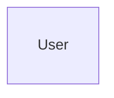

# Facturation SaaS - User Stories
loremloremloremloremloremloremlorem

## Objectif pédagogique : le CRUD, les relations SQL simples et l'authentification.

## Lien du répo GitHub à fork
loremloremlorem

## Critères d'évaluation :
|Critères|Description|
|-|-|
<!-- |MVP|Epic 1 : Gestion des tâches |
|Respect de la maquette |
|   Implémentation du diagramme UML pour la BDD|
| Authorization | Routes privées et publiques|
| Readme.md Documenter le déploiement | Rédigez un Readme qui explique comment lancer l'application à partir d'un serveur ou d'un PC neuf |
|V2 (bonus) | Epic 2 : Organisation & Tri | -->

## Cahier des charges fonctionnel

### Synopsis
loremloremlorem

### Maquette

Maquette interactive :
https://www.figma.com/lorem

### Epic 1 : Facturation

- User Story 1 : En tant qu'entrepreneur, je veux créer un facture détaillé pour un client afin de lui proposer une prestation.
Critères d'acceptation :
    - CA 1 : Je peux ajouter des lignes de produits/services avec description, quantité et prix unitaire.
    - CA 2 : Le total de la facture est calculé automatiquement en fonction des lignes ajoutées.
    - CA 3 : L'utilisateur doit choisir un client existant ou en créer un nouveau pour associer la facture.

- User Story 2 : En tant qu'entrepreneur, je veux transformer une facture validée en facture pdf en un seul clic afin de pouvoir le télécharger et l'envoyer au client.
Critères d'acceptation :
    - CA 1 : Seule une facture validée peut être transformée en facture pdf.
    - CA 2 : La facture pdf doit inclure en bas de page les conditions générales de vente (CGV) de l'entreprise, le SIRET et les conditions de paiement.

- User Story 3 : En tant qu'entrepreneur, je veux marquer une facture comme "Payée" afin de tenir ma comptabilité à jour.
Critères d'acceptation :
    - CA 1 : Je peux marquer une facture comme "Payée" en un clic.
    - CA 2 : Une fois la facture marquée comme "Payée", elle ne peut plus être modifiée.
    - CA 3 : Les factures "Payées" sont affichées dans une section distincte de celles "En attente de paiement" pour faciliter le suivi.
    - CA 4 : Je veux un message de confirmation avant de marquer une facture comme "Payée" pour éviter les erreurs.

### Epic 2 : Statistiques

- User Story 5 : En tant qu'entrepreneur, je veux visualiser mon chiffre d'affaires mensuel sur un graphique afin de suivre la santé de mon entreprise.
Critères d'acceptation :
    - CA 1 : Le graphique affiche le chiffre d'affaires total pour chaque mois de l'année en cours.
    - CA 2 : Je peux filtrer le graphique par année pour comparer les performances d'une année à l'autre.
    - CA 3: Le chiffre d'affaires est calculé en faisant la somme des montants des factures "Payées" pour chaque mois.
    - CA 4 : Je veux pouvoir voir le CA mensuel ou annuel en fonction de la période sélectionnée pour une analyse plus détaillée.
    - CA 5 : Le graphique represente le chiffre d'affaires via un graphiques en barre avec le temps sur l'axe des x et le montant du chiffre d'affaires sur l'axe des y.

### Epic 3 : Paiements

- User Story 6 : En tant qu'entrepreneur, je veux pouvoir valider manuellement une facture pour pouvoir définir une facture comme payé si le client a payé via virement ou en espece.

- User Story 7 : En tant qu'entrepreneur, je veux pouvoir générer et envoyer un lien de paiement par mail pour que le client puisse payer la facture.
    - CA 1 : Je peux générer un lien de paiement sécurisé pour chaque facture en attente de paiement.
    - CA 2 : Le lien de paiement doit rediriger le client vers une page de paiement où il peut entrer ses informations de paiement et finaliser la transaction.
    - CA 3 : Je veux recevoir une notification par mail lorsque le paiement est effectué.
    - CA 4 : Le lien de paiement doit être visible sur l'interface de la facture concernée pour que je puisse le copier et l'envoyer manuellement si besoin.
    - CA 5 : Le mail utilisé pour l'envoie du lien de paiement est celui du client associé à la facture.
    - CA 6 : La facture "en attente de paiement" passe en "payé" dès que le paiement à été effectué.

- User Story 8 : En tant qu'entrepreneur, je veux pouvoir relancer un client par mail en cas de non-paiement afin de récupérer les sommes dues.
Critères d'acceptation :
    - CA 1 : Je peux envoyer un email de relance directement depuis l'interface via un bouton "Relancer" associé à chaque facture en attente de paiement.
    - CA 2 : L'email de relance doit inclure un lien vers la facture concernée au format pdf et l'IBAN de l'entreprise pour faciliter le paiement.
    - CA 3 : Je veux pouvoir personnaliser le message de relance avant de l'envoyer.

<!-- 
## Epic 4 : Gestion des Entités (Nouvel Epic)
La gestion des clients et des produits est implicite dans vos stories, mais il serait utile de la détailler.

User Story (Gestion Clients) : En tant qu'entrepreneur, je veux avoir un répertoire de mes clients (CRM simple) afin de retrouver facilement leurs informations (contact, adresse, historique des factures).

Critères d'acceptation :
CA 1 : Je peux créer, voir, modifier et supprimer un client.
CA 2 : Chaque client a une fiche détaillée avec ses informations et la liste de tous ses documents (devis, factures).
User Story (Gestion Catalogue) : En tant qu'entrepreneur, je veux gérer un catalogue de mes produits et services afin de les ajouter rapidement à mes devis et factures sans avoir à retaper la description et le prix à chaque fois.

Critères d'acceptation :
CA 1 : Je peux créer, modifier et supprimer un produit/service dans mon catalogue.
CA 2 : Lorsque j'ajoute une ligne à une facture/devis, je peux sélectionner un article depuis mon catalogue pour pré-remplir les informations.
Epic 5 : Comptabilité et Export (Nouvel Epic)
Pour faciliter la vie de l'entrepreneur, l'export des données pour son comptable est une fonctionnalité clé.

User Story (Export Comptable) : En tant qu'entrepreneur, je veux pouvoir exporter mes données de facturation (factures, paiements) sur une période donnée (ex: par trimestre) dans un format standard (CSV, Excel) afin de les transmettre facilement à mon comptable.
Critères d'acceptation :
CA 1 : Je peux sélectionner une plage de dates pour l'export.
CA 2 : L'export contient des informations clés comme le numéro de facture, la date, le nom du client, le montant HT, le montant de la TVA, et le montant TTC.
CA 3 : Je peux filtrer pour n'exporter que les factures payées.
Ces ajouts vous rapprocheront d'une solution plus complète comme Henrri, en couvrant le cycle de vente de bout en bout (du devis à la comptabilité) et en améliorant l'efficacité de l'utilisateur. -->

## Cahier des charges non fonctionnel (technique et implémentation)

## UML

### EntityRelation
