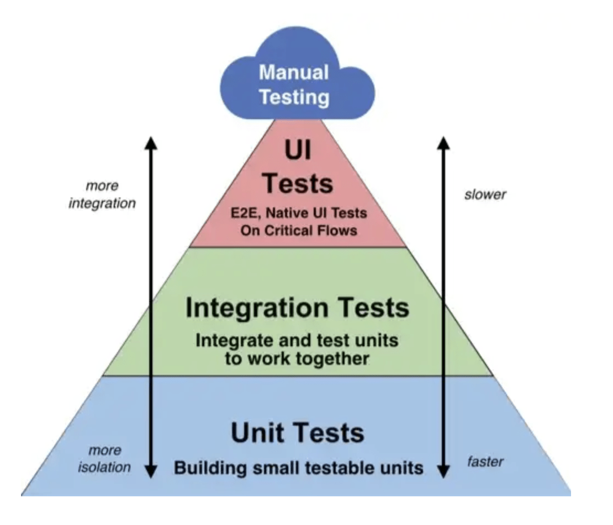

<!--  -->

# Test avec PHPUnit

## A quoi servent les Tests ?

Souvent quand on rajoute une feature une autre bug apparait. Vous connaissez deux moyens de vérifier si un nouveau bug est apparu : testerà la main ou le faire tester par un utilistaur. Cependant ces méthodes de tests sont : couteuses en temps et en argent et surtout ABSOLUMENT PAS FIABLES !

La solution : Ecrire des tests autamatisés pour chaque feature, ces tests vérifie le fonctionnement du logiciel fonctions après fonctions et il effectue cette action au lancement d'une simple ligne de commande linux ! 

## Documentation

- Symfony : https://symfony.com/doc/current/testing.html
- PHPUnit : https://docs.phpunit.de/en/13.1/
- Commande d'assertation : https://docs.phpunit.de/en/13.1/assertions.html

## Ligne de commande

### Créer un test

Soit le service suivant : 

```php
<?php
namespace App\Services;


class GeometryService{
    public function calculateSquareArea(float $side): float {
        return $side * $side;
    }

    public function calculateCircleArea(float $radius): float {
        return pi() * pow($radius, 2);
    }
}
```

1. Pour fabriquer un test pour mon service j'execute la commande suivante dans mon terminal (choissez l'option Test Case) :
    - choissez l'option Test Case
    - Nommez votre test : `ServiceNameTest` (exemple : `GeometryServiceTest`)

```bash
symfony console make:test
```

> - *Si vous n'injecter aucun service, repo ou autre dans votre test selectionnez : `Unit Test`*
> - ***Si vous injecter un service**, repo ou autre dans votre test selectionnez : `Test Case`*

2. La classe de test suivante est générée :

```php
<?php

namespace App\Tests;

use App\Services\GeometryService;
use Symfony\Bundle\FrameworkBundle\Test\KernelTestCase;

class GeometryServiceTest extends KernelTestCase
{
    
}
```

3. Enfin pour ecrire un test ajouter une méthode public à la classe : 
    - Le nom de la méthode doit commencer par `test`
```php
<?php

namespace App\Tests;

use App\Services\GeometryService;
use Symfony\Bundle\FrameworkBundle\Test\KernelTestCase;

class GeometryServiceTest extends KernelTestCase
{
    public function testCalculateSquareArea():void
    {

    }

}
```

4. Ensuite dans la méthode vous pouvez faire des assertions(des affirmations) avec la  pour vérifier le bon fonctionnement de votre code.
Ici j'utilise l'assertion `assertEquals` pour vérifier que le résultat de `5*5` est égal à `25` et j'ajoute un message d'erreur qui s'affichera si le test échoue.

```php
<?php

namespace App\Tests;

use App\Services\GeometryService;
use Symfony\Bundle\FrameworkBundle\Test\KernelTestCase;

class GeometryServiceTest extends KernelTestCase
{
    public function testCalculateSquareArea():void
    {
        $this->assertEquals(25,5*5,"5*5 est égal à 25");
    }

}
```

5. Ce test est inutile car il ne test pas le service pour injecter le service et le rendre diposnible dans la classe de test il faut ajouter un attribut priivate et l'initialiser dans la méthode `setUp` qui est une méthode magique qui s'execute avant chaque test.

```php
<?php

namespace App\Tests;

use App\Services\GeometryService;
use Symfony\Bundle\FrameworkBundle\Test\KernelTestCase;

class GeometryServiceTest extends KernelTestCase
{
    protected function setUp(): void
    {
        self::bootKernel();
        $this->geometryService = self::getContainer()->get(GeometryService::class);
    }

    public function testCalculateSquareArea():void
    {
        $returnValue = $this->geometryService->calculateSquareArea(5);
        $this->assertEquals(25, $returnValue, "5*5 doit être égal à 25");
    }

}
```

### Lancer les tests

Pour lancer le test il suffit d'executer la commande suivante dans le terminal :

```bash
php bin/phpunit
```

1. Modifier le test en changeant de 25 à 26 et relancer le test pour voir le message d'erreur s'afficher.
```bash
There was 1 failure:

1) App\Tests\GeometryServiceTest::testCalculateSquareArea
La surface d'un carré de coté 5 doit être égal à 25
Failed asserting that 25.0 matches expected 26.
``` 


## Objectif

Un bon test coverage représente d'environ 80% de votre code, cela signifie que 80% de vos classes sont testées par des tests automatisés.

1. Forkez et clonez le projet suivant : https://github.com/CHAOUCHI/phase3-testing-exercices
2. Je vous ai créé des services et des classes de Test, il vous faut remplir les méthodes de test avec les bonnes assertions pour que les tests passent.

