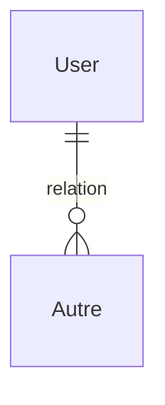
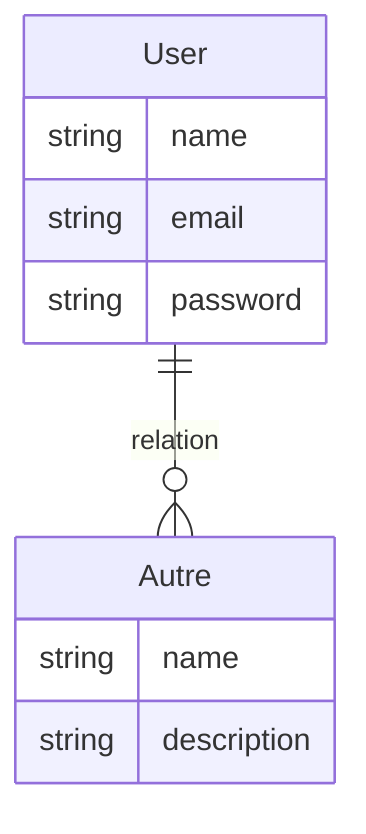
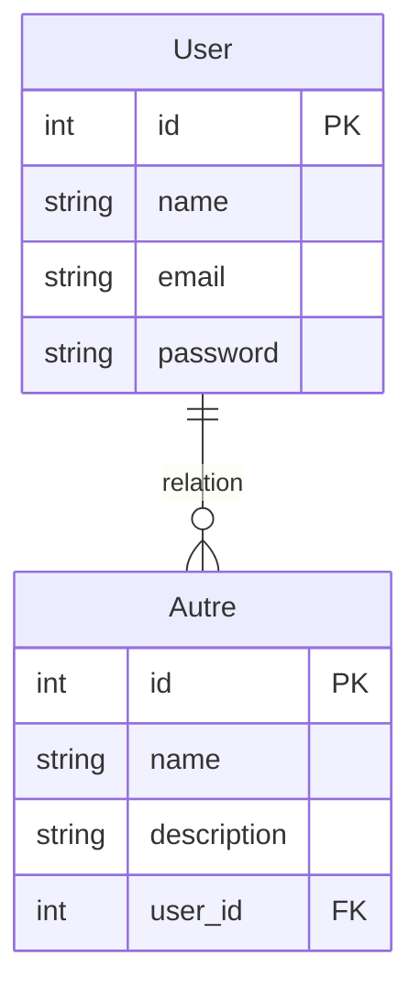

> Les diagrammes de données sont obligatoires pur implementer les permières migrations à votre projet

> 1. Entity Relation : Relation mais acune colonnes.
> 2. MCD : Relation avec les colonnes mais sans les clés primaires et étrangères.
> 3. MLD : Relation avec les colonnes et les clés primaires et étrangères

*Entity Relation*

*MCD*

*MLD avec les clés primaires et étrangères*
