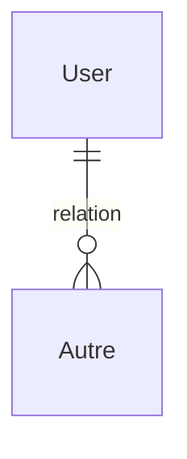
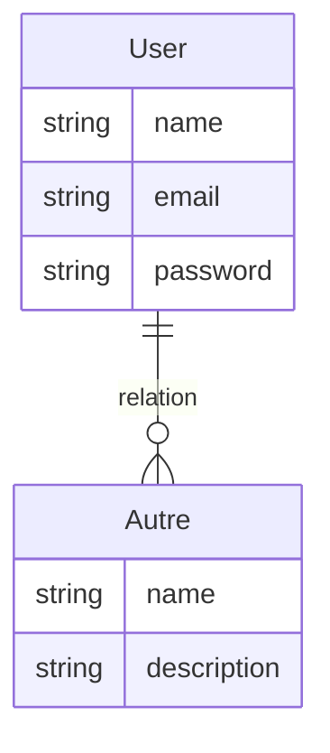
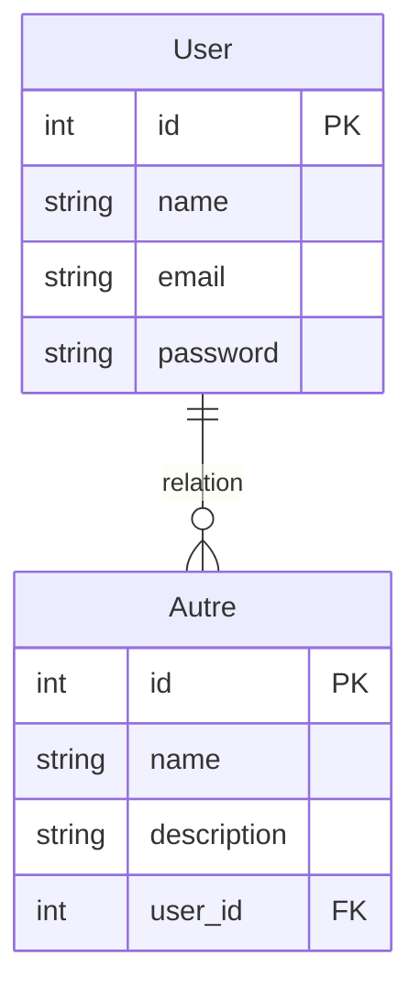

> Les diagrammes de données sont obligatoires pur implementer les permières migrations à votre projet

> 1.  Entity Relation : Relation mais acune colonnes.
> 2. MCD : (modèle conceptuel) Relation avec les colonnes mais sans les clés primaires et étrangères.
> 3. MLD : (modele logique)Relation avec les colonnes et les clés primaires et étrangères
> 4. MPD : le script SQL (modele physique)

*Entity Relation MCD*



*MCD*


*MLD avec les clés primaires et étrangères*


*MPD (schema ou concatenation des migrations)*
```sql
CREATE TABLE ...

```

# Methode Merise 
Merise est une méthode de conception structurée, très utilisée en France pour les systèmes d'information. Elle repose sur une séparation claire entre les données et les traitements.

Les modèles (diagramme) suivants sont aux cœur de Merise, mais ils ont des rôles spécifiques :
 - MCD (Modèle Conceptuel de Données) : C'est le cœur de Merise. Il représente les données et leurs relations de manière abstraite (sans se soucier de l'implémentation technique). C'est ici que l'on utilise les entités et les associations.
 - MLD (Modèle Logique de Données) : Il traduit le MCD en une structure logique adaptée au type de base de données (généralement relationnelle, sous forme de tables avec des colonnes et des types pour chaque colonne coherante par rapport au SGDB choisis ).
 - MPD (Modèle Physique de Données) : C'est l'étape finale où le MLD est converti en scripts SQL pour créer réellement la base de données.


